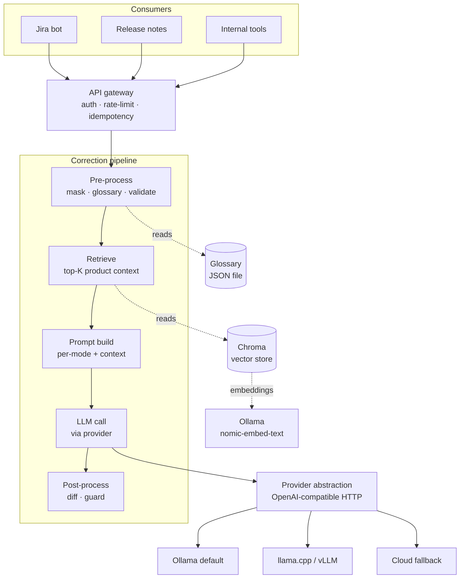

# text-checker

An internal HTTP service that grammar-, style-, and clarity-corrects English text on behalf of other internal tools. One API, swappable LLM backends, observable, grounded with your product knowledge.

---

## Table of contents

- [Problem](#problem)
- [Solution approach](#solution-approach)
- [Architecture](#architecture)
- [Prerequisites](#prerequisites)
- [Setup and first run](#setup-and-first-run)
- [Quick start: full stack walkthrough](#quick-start-full-stack-walkthrough)
- [Running on Linux / RHEL](#running-on-linux--rhel)
- [Running behind a corporate proxy](#running-behind-a-corporate-proxy)
- [Configuration](#configuration)
- [API reference](#api-reference)
- [Worked examples](#worked-examples)
- [Modes](#modes)
- [Glossary (protected terms)](#glossary-protected-terms)
- [RAG over product docs](#rag-over-product-docs)
- [Operating the service](#operating-the-service)
- [Testing](#testing)
- [Development workflow](#development-workflow)
- [Project layout](#project-layout)
- [Roadmap](#roadmap)
- [Troubleshooting](#troubleshooting)

---

## Problem

Internal tools across the company surface English text that humans then correct by hand: Jira ticket descriptions written in shorthand, release notes that need to read like release notes, Confluence pages with typos, customer-facing emails. The pattern repeats across teams, with no shared infrastructure.

Existing solutions don't fit:
- Grammarly and similar SaaS tools are per-user desktop apps, not embeddable in our automation.
- Cloud LLM APIs (Claude, GPT) work but introduce cost, latency, and a hard external dependency for an internal workflow.
- Hand-rolling a model integration per tool means each tool reimplements masking, prompt templating, hallucination checks, and metrics.

What we need is a single HTTP service that any internal tool can call, that runs on locally-hosted models by default, that understands our product terminology, and that we can point at a better model the day one shows up.

## Solution approach

A small FastAPI service that wraps an LLM behind a deterministic pipeline:

1. **Pre-process**: mask code blocks, URLs, `@mentions`, ticket IDs (`PROJ-123`), and **glossary terms** (your product names, feature names, jargon) with placeholder tokens so the LLM never rewrites them. Reject non-English and oversized inputs.
2. **RAG retrieval**: when product docs have been ingested, find the top-K most relevant chunks for this input via embedding similarity and inject them into the system prompt as labeled context.
3. **Prompt build**: pick a per-mode system prompt (grammar, style, jira-story, release-note), augmented with RAG context if any.
4. **LLM call**: send the masked text to the configured provider.
5. **Post-process**: unmask placeholders, compute a structured diff, and run a hallucination guard before returning anything.

Every provider speaks the same OpenAI-compatible chat-completions API, so swapping Ollama for vLLM, llama.cpp, Anthropic, or OpenAI is a config change, not a code change. The service ships with Ollama as the default and a cloud-fallback path that activates only when an API key is configured.

Metrics, structured logs, and an eval harness against a golden dataset are wired from day one so we can tell whether a new model is actually better.

## Architecture



Key design choices, with rationale:

- **Deterministic pipeline around a single LLM call.** Everything that can be done with regex, retrieval, or library code (masking, glossary, RAG retrieval, length checks, diffing, guarding) is done outside the model. The LLM does only what models are good at: producing better-sounding text.
- **Provider abstraction at the HTTP layer, not the SDK layer.** All providers speak OpenAI-compatible chat-completions, so the service code only knows one protocol. Swapping providers is a `base_url` and `api_key` change.
- **Glossary + RAG for product grounding.** Glossary protects exact strings (product names, feature names). RAG injects relevant doc context so the model understands what your products and modules actually *do*. Together they handle the cases that prompt-only solutions miss.
- **Hallucination guard with a safe fallback.** Four checks catch leftover placeholders, dropped masked tokens (including glossary terms), excessive edit ratio, and new entity injection. When the guard rejects, the service returns the user's original text with `flagged: true` and `model_output` for debugging — it never returns nonsense silently.
- **In-memory rate limit and idempotency for Stage 1.** Both swap to Redis when the service goes multi-replica (Phase 1).

Full design rationale, locked decisions, and the phased roadmap live in [docs/architecture.md](docs/architecture.md). Individual decisions are tracked as [ADRs](docs/decisions/).

## Prerequisites

The service is pure Python — it runs on macOS, any modern Linux (RHEL 8/9, Ubuntu 20.04+, Debian, Alpine via Docker), and Windows via WSL. All commands below are tested on macOS and RHEL 9.

### Required

- **Python 3.12+** — the project pins 3.12; `uv` will download and install it for you if you don't have it.
- **[uv](https://docs.astral.sh/uv/)** — dependency manager.
- **An OpenAI-compatible LLM endpoint** — [Ollama](https://ollama.com/) on `localhost:11434` by default. vLLM, llama.cpp's `llama-server`, Anthropic, or OpenAI all work via the same provider abstraction.

### Optional

- **An embedding model** if you'll use RAG — `ollama pull nomic-embed-text` (~270 MB).
- **Docker + Docker Compose** — for the full local stack (service + Ollama + Prometheus) via `make up`.

### Install commands by OS

| Tool | macOS | RHEL 8 / 9 | Ubuntu / Debian |
|---|---|---|---|
| `uv` | `brew install uv` | `curl -LsSf https://astral.sh/uv/install.sh \| sh` | `curl -LsSf https://astral.sh/uv/install.sh \| sh` |
| Python 3.12 | `brew install python@3.12` *or* let `uv` install it | `sudo dnf module install python:3.12` *or* let `uv` install it | `sudo apt install python3.12` *or* let `uv` install it |
| Ollama | `brew install ollama && ollama serve &` | `curl -fsSL https://ollama.com/install.sh \| sh` (registers as systemd unit, auto-starts) | `curl -fsSL https://ollama.com/install.sh \| sh` |
| Docker | Docker Desktop from docker.com | `sudo dnf install -y docker docker-compose-plugin` | `sudo apt install -y docker.io docker-compose-plugin` |

If letting `uv` install Python 3.12 sounds like a footgun, it's not — `uv` downloads pre-built CPython binaries from Astral's mirror, isolates them under `~/.local/share/uv/python/`, and pins them to the project via `.python-version`. Nothing changes on the system Python.

## Setup and first run

### Option 1: run the service directly with uv

```bash
git clone https://github.com/skyakash/text-checker.git
cd text-checker

# install deps (uv will download Python 3.12 if needed)
make install

# in one shell — start Ollama and pull models
ollama serve &                       # if it isn't already running
ollama pull qwen2.5:7b-instruct      # ~4.7 GB; or qwen2.5:0.5b (397 MB) for a quick smoke test
ollama pull nomic-embed-text         # ~270 MB; only needed if you'll use RAG

# in another shell — start the service
make dev

# smoke test
curl -s http://localhost:8080/healthz
```

The service is now on `http://localhost:8080` with hot reload on file change.

### Option 2: docker compose

Brings up the service, an Ollama container, and a Prometheus container together.

```bash
make up                                              # starts everything
docker compose exec ollama ollama pull qwen2.5:0.5b  # pull a model into the Ollama container
docker compose exec ollama ollama pull nomic-embed-text

curl -s http://localhost:8080/healthz
```

Stop the stack with `make down`.

## Quick start: full stack walkthrough

A single linear recipe that takes you from a fresh clone to a correction that uses **both** the glossary and RAG. Copy-paste each block in order. Most of the elapsed time is the model download in step 2.

### 1. Clone and install

```bash
git clone https://github.com/skyakash/text-checker.git
cd text-checker
make install
```

### 2. Pull the two models (one-time)

```bash
ollama serve &                       # if not already running
ollama pull qwen2.5:7b-instruct      # ~4.7 GB — corrects text
ollama pull nomic-embed-text         # ~270 MB — embeds RAG queries
```

### 3. Start the service

In one shell, leave it running:

```bash
make dev
```

In a second shell, confirm it's up:

```bash
curl -s http://localhost:8080/healthz
# {"status":"ok"}
```

### 4. Create a sample product doc

For this walkthrough — substitute your own docs later:

```bash
mkdir -p sample-docs
cat > sample-docs/flowstate.md <<'EOF'
# Flowstate

Flowstate is our flagship collaborative editor.

## Snapshots

The Snapshot Loader reads serialized editor state from disk and
restores the document tree. Snapshots are taken every 30 seconds.

## Permissions

The Permissions module controls which roles can edit which documents.
Admin, Editor, and Viewer roles are supported.
EOF
```

### 5. Populate the glossary

Two ways. **Manually** for full control:

```bash
uv run python -m text_checker.glossary add Flowstate
uv run python -m text_checker.glossary add "Snapshot Loader"
uv run python -m text_checker.glossary list
# Flowstate
# Snapshot Loader
```

Or **extract from the doc** using the LLM (takes ~10 s on CPU at 7B):

```bash
uv run python -m text_checker.glossary extract sample-docs/flowstate.md --add
```

### 6. Ingest the product doc for RAG

```bash
uv run python -m text_checker.rag ingest sample-docs/flowstate.md --source flowstate
# ingested source=flowstate files=1 chunks=1

uv run python -m text_checker.rag list
# flowstate                       1 chunks
# total: 1 chunks across 1 source(s)
```

Sanity-check retrieval:

```bash
uv run python -m text_checker.rag search "snapshot loader fix" --k 2
# 1. (0.82) flowstate § Snapshots
#    The Snapshot Loader reads serialized editor state from disk...
```

### 7. Make a correction that exercises both

A release-note input with a glossary term spelled lowercase and a typo on a feature mentioned in the doc:

```bash
curl -s -X POST http://localhost:8080/v1/correct \
  -H 'content-type: application/json' \
  -d '{
    "text": "we fixed the snapshot loder in flowstate so users dont lose work",
    "mode": "release-note",
    "model": "qwen2.5:7b-instruct"
  }' | jq
```

### 8. What to look for in the response

```json
{
  "corrected_text": "Fixed the Snapshot Loader in Flowstate so users don't lose work.",
  "model_used": "qwen2.5:7b-instruct",
  "flagged": false,
  "rag_context_used": [
    {
      "source": "flowstate",
      "section": "Snapshots",
      "score": 0.82,
      "preview": "The Snapshot Loader reads serialized editor state from disk..."
    }
  ],
  "metrics": {"latency_ms": 1180, "edit_ratio": 0.18}
}
```

Three things to verify:

1. **`corrected_text` contains `Flowstate` and `Snapshot Loader` in their canonical case** — the glossary did its job. Even though you typed `flowstate` (lowercase) and `snapshot loder` (typo), the model never saw those tokens (they were masked), and the post-processor restored them from the glossary with the correct spelling.
2. **`rag_context_used` is non-empty** — RAG found the relevant section. The model's system prompt was augmented with the Snapshots section text, so it knew the term refers to a specific module.
3. **`flagged: false`** — the hallucination guard accepted the correction.

If any of those don't match, jump to [Troubleshooting](#troubleshooting).

### 9. Update workflow — when product docs change

Re-ingest with the same `--source` to drop stale chunks and replace with fresh content in one command:

```bash
uv run python -m text_checker.rag ingest sample-docs/flowstate.md --source flowstate
```

Add new glossary terms as your product evolves:

```bash
uv run python -m text_checker.glossary add "Workspace"
```

Both stores persist under `./data/` (gitignored). Back up the directory to back up your knowledge base.

## Running on Linux / RHEL

Same `make install` / `make dev` workflow as macOS. Platform-specific notes only.

### Bare-metal install on RHEL 9

```bash
# Optional: build deps for any wheels that need compilation.
# Most wheels (chromadb, lxml, pdfplumber) ship binary; this is only needed
# in restricted environments.
sudo dnf install -y gcc python3.12-devel

# uv + ollama
curl -LsSf https://astral.sh/uv/install.sh | sh
curl -fsSL https://ollama.com/install.sh | sh   # registers ollama as a systemd service

# clone, install, run
git clone https://github.com/skyakash/text-checker.git
cd text-checker
make install
make dev
```

### Open the firewall

```bash
sudo firewall-cmd --add-port=8080/tcp --permanent
sudo firewall-cmd --reload
```

### SELinux and Docker bind-mounts

If you bind-mount `./data/` into the container for persistence (instead of using a named volume), SELinux will block the container from reading or writing it. Append `:Z` to the mount so Docker relabels it:

```yaml
volumes:
  - ./data:/app/data:Z
```

Named volumes (the compose file's default for Ollama) don't have this problem.

### Managing Ollama under systemd

The Linux installer registers Ollama as a unit. Useful commands:

```bash
sudo systemctl status ollama
sudo journalctl -u ollama -f          # tail logs
sudo systemctl restart ollama
```

Pulled models live in `/usr/share/ollama/.ollama/` (not `~/.ollama` like macOS).

## Running behind a corporate proxy

The service uses `httpx` for all outbound calls, and `httpx` reads `HTTPS_PROXY` / `HTTP_PROXY` / `NO_PROXY` from the environment automatically. **No Python code changes are needed** — just set the env vars correctly across every layer.

### Required env vars

```bash
export HTTPS_PROXY=http://proxy.corp.example:8080
export HTTP_PROXY=http://proxy.corp.example:8080
# Critical: bypass the proxy for local Ollama and any internal hostnames.
# Missing this is the most common proxy mistake.
export NO_PROXY=localhost,127.0.0.1,ollama,service,prometheus
```

For a persistent setup, put the same lines in `.env` (the `.env.example` file shows them commented out).

### Ollama under systemd needs its own proxy config

The service env vars do **not** propagate to the Ollama daemon. To pull models through the proxy, override the systemd unit:

```bash
sudo systemctl edit ollama
```

Add:

```ini
[Service]
Environment="HTTPS_PROXY=http://proxy.corp.example:8080"
Environment="HTTP_PROXY=http://proxy.corp.example:8080"
Environment="NO_PROXY=localhost,127.0.0.1"
```

Then:

```bash
sudo systemctl daemon-reload
sudo systemctl restart ollama
```

If running Ollama manually (`ollama serve` in a terminal), just export the vars in that shell first.

### Docker build behind a proxy

The Dockerfile accepts proxy as build args (needed for `uv sync` to reach PyPI):

```bash
docker build \
  --build-arg HTTP_PROXY=$HTTP_PROXY \
  --build-arg HTTPS_PROXY=$HTTPS_PROXY \
  --build-arg NO_PROXY=$NO_PROXY \
  -t text-checker:dev .
```

### docker-compose behind a proxy

The compose file passes proxy env vars through to both `service` and `ollama` containers automatically when set in your shell:

```bash
export HTTPS_PROXY=http://proxy.corp.example:8080
export NO_PROXY=localhost,127.0.0.1,ollama,service,prometheus
docker compose up --build
```

`NO_PROXY` **must** include the compose service names (`ollama`, `service`, `prometheus`) — otherwise inter-container HTTP calls get sent through the external proxy and fail.

### Corporate TLS-intercepting proxies (custom CA)

Many corporate proxies decrypt outbound HTTPS using their own root CA. Python's `ssl` module needs that CA to trust the proxy:

```bash
# bare metal
export SSL_CERT_FILE=/etc/pki/ca-trust/source/anchors/corp-ca.pem

# or update the system trust store on RHEL
sudo cp corp-ca.pem /etc/pki/ca-trust/source/anchors/
sudo update-ca-trust
```

For Docker, mount the CA into the container:

```yaml
# docker-compose.yml override
services:
  service:
    volumes:
      - /etc/pki/ca-trust/source/anchors/corp-ca.pem:/etc/ssl/certs/corp-ca.pem:ro
    environment:
      SSL_CERT_FILE: /etc/ssl/certs/corp-ca.pem
```

The compose file's `SSL_CERT_FILE: ${SSL_CERT_FILE:-}` line already forwards the variable from your shell — combined with a volume mount in an override file, that's enough.

### Verifying the proxy setup

```bash
# proxy reachable
curl --proxy $HTTPS_PROXY -sI https://api.openai.com/v1/models | head -1

# from inside the running service container
docker compose exec service python -c \
  "import httpx; print(httpx.get('https://api.openai.com/v1/models', timeout=10).status_code)"
```

Both should return a non-zero exit and a valid HTTP status (401 from OpenAI is fine — it means the request reached them).

## Configuration

All configuration is via environment variables. Copy `.env.example` to `.env` and edit as needed.

| Variable | Default | Purpose |
|---|---|---|
| `LOG_LEVEL` | `INFO` | Standard log levels: `DEBUG`, `INFO`, `WARNING`, `ERROR` |
| `API_KEYS` | (empty) | Comma-separated list of accepted API keys. **When empty, auth is disabled** — fine for dev, must be set in prod. |
| `OLLAMA_BASE_URL` | `http://localhost:11434/v1` | OpenAI-compatible base URL for the primary provider |
| `DEFAULT_MODEL` | `qwen2.5:7b-instruct` | Model used for `quality_tier=balanced` (the default) |
| `FAST_MODEL` | `qwen2.5:0.5b` | Model used for `quality_tier=fast` |
| `ANTHROPIC_API_KEY` | (empty) | When set, Anthropic registers as a cloud provider for `quality_tier=high` |
| `ANTHROPIC_BASE_URL` | `https://api.anthropic.com/v1` | Anthropic's OpenAI-compatible endpoint |
| `ANTHROPIC_MODEL` | `claude-haiku-4-5` | Model used when routing to Anthropic |
| `OPENAI_API_KEY` | (empty) | When set, OpenAI registers as a fallback cloud provider |
| `OPENAI_BASE_URL` | `https://api.openai.com/v1` | OpenAI's chat-completions endpoint |
| `OPENAI_MODEL` | `gpt-4o-mini` | Model used when routing to OpenAI |
| `GLOSSARY_PATH` | `./data/glossary.json` | JSON file storing protected terms |
| `RAG_ENABLED` | `true` | Toggle RAG retrieval. Auto-skips silently when the store is empty. |
| `RAG_STORE_PATH` | `./data/rag` | Where Chroma persists its embeddings |
| `RAG_COLLECTION_NAME` | `products` | Collection name within the store |
| `RAG_EMBEDDING_MODEL` | `nomic-embed-text` | Embedding model served via Ollama |
| `RAG_EMBEDDING_BASE_URL` | (defaults to `OLLAMA_BASE_URL`) | Override if embeddings live elsewhere |
| `RAG_TOP_K` | `3` | Number of chunks to retrieve and inject |
| `RAG_MIN_SCORE` | `0.50` | Drop chunks below this cosine similarity. Calibrated for `nomic-embed-text` on small-to-medium corpora; raise to 0.60–0.70 for dense corpora where stricter matches are available. Use `rag search` to see your actual score distribution before tuning. |
| `RAG_SKIP_MODES` | `grammar` | Comma-separated modes that skip RAG entirely. Per-request `use_rag: true` overrides. |
| `REDIS_URL` | (empty) | Reserved for Phase 1 |
| `OTEL_EXPORTER_OTLP_ENDPOINT` | (empty) | Reserved for Phase 1 |

## API reference

### `POST /v1/correct`

Correct a piece of text.

**Headers**

| Header | Required | Notes |
|---|---|---|
| `Content-Type: application/json` | yes | |
| `X-API-Key` | only when `API_KEYS` is configured | One of the configured keys |
| `Idempotency-Key` | optional | Same key returns the cached response for 10 minutes without re-calling the LLM |

**Request body**

```json
{
  "text": "their going home tonigt",
  "mode": "grammar",
  "model": "qwen2.5:7b-instruct",
  "quality_tier": "balanced",
  "use_rag": null
}
```

| Field | Type | Default | Notes |
|---|---|---|---|
| `text` | string | required | 1–20,000 characters |
| `mode` | enum | `grammar` | One of `grammar`, `style`, `jira-story`, `release-note` |
| `model` | string | (router picks) | Override the model. When unset, `quality_tier` decides. |
| `quality_tier` | enum | `balanced` | `fast`, `balanced`, or `high`. `high` routes to a cloud provider if one is configured. |
| `use_rag` | bool \| null | `null` | `true`/`false` forces RAG on or off for this call; `null` uses `RAG_ENABLED`. |

**Successful response** (HTTP 200)

```json
{
  "request_id": "21486032-a9c4-44fb-bb4d-9b798e226cdc",
  "corrected_text": "They are going home tonight.",
  "diff": [
    {"op": "replace", "old": "their", "new": "They are"},
    {"op": "replace", "old": "tonigt", "new": "tonight."}
  ],
  "model_used": "qwen2.5:7b-instruct",
  "flagged": false,
  "flag_reason": null,
  "model_output": null,
  "rag_context_used": [
    {"source": "flowstate", "section": "Snapshots", "score": 0.84,
     "preview": "The snapshot loader reads serialized editor state from disk..."}
  ],
  "metrics": {
    "latency_ms": 1334,
    "tokens_in": 73,
    "tokens_out": 7,
    "edit_ratio": 0.176
  }
}
```

`rag_context_used` is empty when RAG is off, when the store is empty, or when no chunks scored above `RAG_MIN_SCORE`.

**Flagged response** (HTTP 200, but the model's output was rejected by the guard)

```json
{
  "request_id": "676a4fdf-d46e-43bf-af1f-ddbb1603483a",
  "corrected_text": "fixed bug where users couldnt save thier profile see @alice or https://example.com/docs",
  "diff": [],
  "model_used": "qwen2.5:0.5b",
  "flagged": true,
  "flag_reason": "model dropped masked token 'https://example.com/docs'",
  "model_output": "fixed bug where users were unable to save their profile, either through \"See\" or \"Edit\".",
  "rag_context_used": [],
  "metrics": {
    "latency_ms": 226,
    "tokens_in": 90,
    "tokens_out": 21,
    "edit_ratio": 0.0
  }
}
```

When `flagged: true`:
- `corrected_text` is your **original input**, returned unchanged for safety.
- `model_output` shows what the model said so you can decide whether to retry with a different model or escalate.
- `flag_reason` names the specific check that failed.

**Error responses**

| Status | Cause | Body |
|---|---|---|
| 401 | Missing or wrong `X-API-Key` (only when `API_KEYS` is set) | `{"detail": "invalid or missing API key"}` |
| 413 | Input over the configured max length (default 5000 chars) | `{"detail": "input length N exceeds limit 5000"}` |
| 422 | Non-English input detected by heuristic | `{"detail": "input does not appear to be English"}` |
| 429 | Rate limit exceeded (default 60/min per key) | `{"detail": "rate limit exceeded"}` |
| 502 | Upstream LLM provider error | `{"detail": "upstream provider error: ..."}` |

### `GET /v1/modes`

```json
["grammar", "style", "jira-story", "release-note"]
```

### `GET /v1/models`

Lists the models the registry will route to, based on configuration.

```json
["qwen2.5:7b-instruct", "qwen2.5:0.5b"]
```

### `GET /healthz`, `GET /readyz`

Liveness and readiness probes for Kubernetes.

### `GET /metrics/`

Prometheus exposition format. Note the trailing slash.

## Worked examples

These are real responses captured from the running service. Latency is on an M-series Mac CPU, no GPU.

### Grammar correction

```bash
curl -s -X POST http://localhost:8080/v1/correct \
  -H 'content-type: application/json' \
  -d '{"text":"their going home tonigt","mode":"grammar","model":"qwen2.5:7b-instruct"}' | jq
```

```json
{
  "corrected_text": "They are going home tonight.",
  "model_used": "qwen2.5:7b-instruct",
  "flagged": false,
  "metrics": {"latency_ms": 1334, "edit_ratio": 0.18}
}
```

### Jira story rewrite, with ticket-ID preservation

```bash
curl -s -X POST http://localhost:8080/v1/correct \
  -H 'content-type: application/json' \
  -d '{"text":"as a user i want logout button so i can log out from PROJ-123","mode":"jira-story","model":"qwen2.5:7b-instruct"}' | jq
```

```json
{
  "corrected_text": "As a user, I want a logout button so that I can log out from PROJ-123.",
  "model_used": "qwen2.5:7b-instruct",
  "flagged": false
}
```

### Idempotent retry

```bash
KEY=$(uuidgen)
curl -s -X POST http://localhost:8080/v1/correct \
  -H "Content-Type: application/json" -H "Idempotency-Key: $KEY" \
  -d '{"text":"their going home","mode":"grammar"}' | jq -r '.request_id'

curl -s -X POST http://localhost:8080/v1/correct \
  -H "Content-Type: application/json" -H "Idempotency-Key: $KEY" \
  -d '{"text":"their going home","mode":"grammar"}' | jq -r '.request_id'
```

Both calls print the same `request_id`. The second never reaches the LLM.

### Rejected input (non-English)

```bash
curl -s -i -X POST http://localhost:8080/v1/correct \
  -H 'content-type: application/json' \
  -d '{"text":"これは日本語の文章です。","mode":"grammar"}'
```

```
HTTP/1.1 422 Unprocessable Entity
{"detail":"input does not appear to be English"}
```

## Modes

| Mode | When to use | Allowed edit ratio | What the prompt asks for |
|---|---|---|---|
| `grammar` | Fix grammar, spelling, and punctuation only | 0.45 | Strict editor; no rewriting |
| `style` | Tighten phrasing, prefer active voice | 0.60 | Style editor; intent preserved |
| `jira-story` | Rewrite shorthand ticket into "As a … I want … so that …" | 0.80 | Jira-story editor; restructure freely |
| `release-note` | Rewrite into a clear verb-first one-liner | 0.80 | Release-notes editor; concise |

In every mode, masked tokens (`@mentions`, URLs, ticket IDs, code blocks, glossary terms) must survive into the output or the result is flagged.

## Glossary (protected terms)

The glossary is a per-installation list of product names, feature names, and internal jargon that must never be rewritten by the LLM. The masker treats them the same way it treats URLs and ticket IDs — replace them with placeholder tokens before sending to the model, restore them in the output with their canonical case.

### Adding terms manually

```bash
uv run python -m text_checker.glossary add Flowstate
uv run python -m text_checker.glossary add "Snapshot Loader"
uv run python -m text_checker.glossary list
```

### Extracting terms from your product docs (LLM-based)

The extractor uses the configured LLM to suggest terms from your existing product documentation:

```bash
# preview suggested terms without modifying the glossary
uv run python -m text_checker.glossary extract docs/flowstate.md
uv run python -m text_checker.glossary extract ./product-docs --recursive

# extract and add in one step (after reviewing)
uv run python -m text_checker.glossary extract docs/flowstate.md --add
```

Loaders handle markdown, plain text, HTML, and PDF. Long docs are chunked automatically before being passed to the LLM. Output is deduplicated across chunks.

### Importing from a file

```bash
# one term per line
echo -e "Flowstate\nEditor\nSnapshot Loader" > my-terms.txt
uv run python -m text_checker.glossary import my-terms.txt

# or pipe from another command
... | uv run python -m text_checker.glossary import -
```

### What the masker does

When the user submits `we shipped flowstate today` and the glossary contains `Flowstate`:

1. Pre-processor matches `flowstate` (case-insensitive) and replaces with `<<MASK_N>>`
2. LLM sees `we shipped <<MASK_N>> today`, returns its correction
3. Post-processor unmasks the placeholder back to `Flowstate` (the canonical case from the glossary)
4. Output: `We shipped Flowstate today.`

The model never sees the glossary term, so it cannot rewrite it. Case is restored from the glossary, not preserved from input, so the user gets the spelling you want even if they typed it wrong.

## RAG over product docs

RAG gives the model context about *what your products do*: features, modules, terminology, behavior. When the user submits `we fixed the snapshot loader`, the retriever finds the relevant doc chunks (`Snapshots: the snapshot loader reads serialized editor state...`) and injects them into the system prompt so the model preserves domain meaning during correction.

The current build ships with:
- Chroma embedded vector store (persists to `./data/rag/`)
- Embeddings via Ollama (`nomic-embed-text` by default)
- Markdown, plain text, HTML, and PDF loaders
- Paragraph-aware chunker with section tracking
- CLI for ingest, list, search, remove, reset

### Setup

```bash
ollama pull nomic-embed-text
```

### Ingesting product docs

```bash
# single file
uv run python -m text_checker.rag ingest docs/flowstate.md --source flowstate

# whole directory, recursively
uv run python -m text_checker.rag ingest ./product-docs --source flowstate --recursive

# inspect what's stored
uv run python -m text_checker.rag list
# flowstate                   42 chunks
# total: 42 chunks across 1 source(s)
```

`--source` is the logical re-ingest unit. Re-running ingest with the same `--source` first removes its existing chunks, then adds the fresh ones — that's how "update with latest content" works without leaving stale chunks behind.

### Debugging retrieval

See exactly what would be retrieved for a given input:

```bash
uv run python -m text_checker.rag search "we improved the snapshot loader" --k 3
# 1. (0.84) flowstate § Snapshots
#    The snapshot loader reads serialized editor state from disk...
# 2. (0.71) flowstate § Editor
#    The Editor module is responsible for...
```

### Per-request override

```json
POST /v1/correct
{
  "text": "...",
  "mode": "grammar",
  "use_rag": false
}
```

`use_rag: false` skips retrieval for this request even when the store has docs. `use_rag: true` forces retrieval. `null` (default) follows `RAG_ENABLED`.

### What goes into the prompt

The system prompt is augmented with a labeled context block before the mode instructions:

```
You are a strict grammar editor. ...

Context about products and terminology that may appear in this text:
---
[flowstate § Snapshots]
The snapshot loader reads serialized editor state from disk...

[flowstate § Editor]
The Editor module handles...
---
Use this context to preserve product-specific terminology and meaning.
Do not introduce information not present in the input text.
```

That last line matters: RAG context grounds **meaning**, it does not license the model to invent new content. The hallucination guard's new-entity check catches injection from doc context the same way it catches general hallucination.

### Removing sources

```bash
# drop one source
uv run python -m text_checker.rag remove flowstate

# wipe everything (asks for YES to confirm)
uv run python -m text_checker.rag reset
```

## Operating the service

### Metrics

`GET /metrics/` returns Prometheus exposition format. Key series:

- `correct_requests_total{mode, model, status}` — counter. `status` is `ok`, `flagged`, `rejected_lang`, `rejected_size`, or `upstream_error`.
- `correct_latency_seconds{mode, model}` — histogram of end-to-end correction latency.
- `rag_retrieval_score{mode}` — histogram of cosine similarity scores for every chunk returned by RAG retrieval, observed **before** the `RAG_MIN_SCORE` filter. Lets you calibrate the floor from real traffic.

Useful PromQL for tuning `RAG_MIN_SCORE`:

```promql
# Median retrieval score per mode — if this sits well above your floor,
# you have headroom to raise the floor for stricter matches.
histogram_quantile(0.5, sum(rate(rag_retrieval_score_bucket[5m])) by (le, mode))

# 95th percentile — anything below this is the band you would lose by
# raising the floor; anything above is signal you'd keep.
histogram_quantile(0.95, sum(rate(rag_retrieval_score_bucket[5m])) by (le, mode))
```

Without Prometheus, the same shape is visible by curl:

```bash
curl -s localhost:8080/metrics/ | grep "^rag_retrieval_score" | grep -v "^#"
```

Scrape config snippet (for the docker-compose stack):

```yaml
scrape_configs:
  - job_name: text-checker
    static_configs:
      - targets: ["text-checker:8080"]
    metrics_path: /metrics/
```

### Structured logs

One JSON line per request via `structlog`:

```json
{"event":"http_request","method":"POST","path":"/v1/correct","status_code":200,"duration_ms":1334,"level":"info","timestamp":"2026-06-17T..."}
```

`/healthz`, `/readyz`, and `/metrics/` are deliberately excluded.

### Health checks

- `/healthz` — process is alive
- `/readyz` — service can accept requests (active provider probe is a Phase 1 follow-up)

## Testing

| Command | What it runs |
|---|---|
| `make test` | The full unit + contract test suite (~130 tests, ~2 sec) |
| `make test-integration` | End-to-end tests against a real Ollama. Auto-skipped if Ollama isn't reachable. |
| `make eval ARGS="--model qwen2.5:7b-instruct"` | Runs the golden-set scorecard against a live service on `localhost:8080` |

## Development workflow

```bash
make install      # uv sync
make dev          # uvicorn with --reload
make test         # pytest -q
make lint         # ruff check
make fmt          # ruff format
make typecheck    # mypy strict
make up           # docker compose up
make down         # docker compose down
make build        # docker build
make clean        # remove caches
```

## Project layout

```
text-checker/
├── src/text_checker/
│   ├── api/             HTTP layer: routes, schemas, auth, rate limit, idempotency
│   ├── pipeline/        Pre-process, prompts, orchestrator, post-process
│   ├── providers/       Provider abstraction, OpenAI-compat client, registry
│   ├── glossary/        Protected-term store, CLI, LLM-based extractor
│   ├── rag/             Vector store, loaders, chunker, retriever, ingest, CLI
│   ├── observability/   Prometheus metrics, structured logging
│   ├── eval/            CLI scorecard harness
│   ├── config.py        pydantic-settings, 12-factor env config
│   └── main.py          FastAPI app, middleware, health endpoints
├── tests/
│   ├── unit/            Pure-Python unit tests
│   ├── contract/        Provider HTTP contract tests (respx)
│   ├── integration/     E2E against a running Ollama
│   └── eval/data/       Golden dataset (JSONL)
├── deploy/
│   ├── prometheus.yml   Scrape config for the docker-compose stack
│   └── k8s/             Reserved for Phase 1 helm chart
├── docs/
│   ├── architecture.md  Design rationale and roadmap
│   └── decisions/       ADRs (architecture decision records)
├── docker-compose.yml   service + ollama + prometheus
├── Dockerfile           Multi-stage (uv build → slim runtime)
├── Makefile             Dev targets
└── pyproject.toml       uv-managed; ruff, mypy, pytest config
```

## Roadmap

- **Stage 1** — Service, pipeline, provider abstraction, hardening, Prometheus, structured logs, eval harness.
- **Stage 2 (current)** — Glossary store + LLM-based extractor + masker integration. RAG over product docs with multi-format loaders, Chroma store, Ollama embeddings, retrieval, orchestrator integration.
- **Phase 1 — Production readiness.** Redis-backed rate-limit + idempotency (multi-replica), Postgres request log, OpenTelemetry traces, helm chart, active provider probe on `/readyz`. Swap Chroma to pgvector when Postgres lands.
- **Phase 2 — Quality flywheel + multi-tenancy.** Real eval metrics (GLEU, BERTScore, LLM-judge), per-model Grafana scorecard, `/v1/feedback`, A/B routing, per-tenant glossary and RAG isolation.
- **Phase 3 — Critic-reviser + chunker.** Opt-in `quality_tier=high` writer → critic → reviser loop with a one-revision cap. Sentence-aware chunker for long inputs.
- **Phase 4 — Example RAG + fine-tune.** Few-shot RAG over approved (before, after) corrections. Per-tenant LoRA candidates gated by the eval harness.

Full design rationale in [docs/architecture.md](docs/architecture.md). Individual decisions in [docs/decisions/](docs/decisions/).

## Troubleshooting

**`make test` complains "uv not found".**
Install uv: `brew install uv` (macOS) or `curl -LsSf https://astral.sh/uv/install.sh | sh`.

**Every `/v1/correct` call returns 502 with "upstream provider error".**
Ollama isn't running or isn't reachable at `OLLAMA_BASE_URL`. Check `curl http://localhost:11434/api/tags`. Start Ollama with `ollama serve`.

**Every call returns `flagged: true` with "model dropped masked token".**
The model is too small to follow instructions reliably. Pull a larger model: `ollama pull qwen2.5:7b-instruct`, then either set `DEFAULT_MODEL=qwen2.5:7b-instruct` in `.env` or pass `"model": "qwen2.5:7b-instruct"` per request.

**Latency is several seconds for short inputs.**
Expected at 7B on CPU. For interactive UIs prefer `qwen2.5:0.5b` via `quality_tier=fast`, or configure a cloud provider via `ANTHROPIC_API_KEY` and pass `quality_tier=high`.

**`/metrics` returns a 307 redirect.**
The Prometheus mount lives at `/metrics/` with a trailing slash. Prometheus scrapers follow the redirect automatically; ad-hoc `curl` needs the trailing slash.

**RAG retrieval is empty / `rag_context_used: []` always.**
Either the store is empty (check `uv run python -m text_checker.rag list`), the embedding model isn't pulled (`ollama pull nomic-embed-text`), the mode is in `RAG_SKIP_MODES` (default skips `grammar`), or all matches fell below `RAG_MIN_SCORE` (default 0.65). For grammar mode specifically, pass `"use_rag": true` per request to force RAG; for global change, set `RAG_SKIP_MODES=""`.

**RAG retrieved context that misled the model.**
This is exactly why the 0.65 floor and grammar skip exist (see ADR-0011). If you're seeing it for non-grammar modes, raise `RAG_MIN_SCORE` (e.g., to 0.75) or remove the offending source with `python -m text_checker.rag remove <source>` and re-ingest narrower content.

**`rag ingest` fails with embedding errors.**
The embedding endpoint defaults to `OLLAMA_BASE_URL`. If your embedding service lives elsewhere, set `RAG_EMBEDDING_BASE_URL`. Verify the model name with `ollama list` and confirm it matches `RAG_EMBEDDING_MODEL`.

**Glossary terms aren't being protected.**
List your terms (`glossary list`). Terms match case-insensitively but with word boundaries — `IO` won't match inside `ratio` for example. Multi-word terms work (`API Reference`) but each word counts toward the match.

**Auth is unexpectedly disabled.**
`API_KEYS` is empty. Set `API_KEYS=key1,key2` in `.env` and restart.
