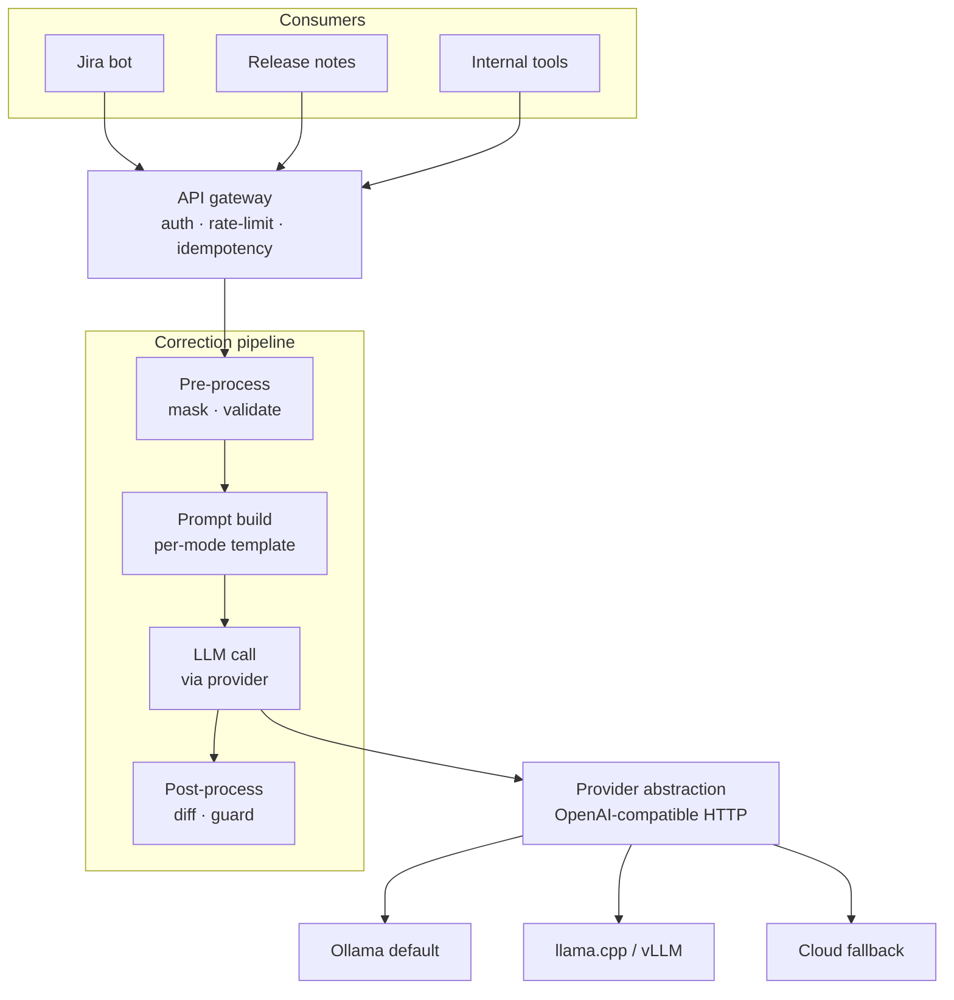

# text-corrector

An internal HTTP service that grammar-, style-, and clarity-corrects English text on behalf of other internal tools. One API, swappable LLM backends, observable.

---

## Table of contents

- [Problem](#problem)
- [Solution approach](#solution-approach)
- [Architecture](#architecture)
- [Prerequisites](#prerequisites)
- [Setup and first run](#setup-and-first-run)
- [Configuration](#configuration)
- [API reference](#api-reference)
- [Worked examples](#worked-examples)
- [Modes](#modes)
- [Operating the service](#operating-the-service)
- [Testing](#testing)
- [Development workflow](#development-workflow)
- [Project layout](#project-layout)
- [Roadmap](#roadmap)
- [Troubleshooting](#troubleshooting)

---

## Problem

Internal tools across the company surface English text that humans then correct by hand: Jira ticket descriptions written in shorthand, release notes that need to read like release notes, Confluence pages with typos, customer-facing emails. The pattern repeats across teams, with no shared infrastructure.

Existing solutions don't fit:
- Grammarly and similar SaaS tools are per-user desktop apps, not embeddable in our automation.
- Cloud LLM APIs (Claude, GPT) work but introduce cost, latency, and a hard external dependency for an internal workflow.
- Hand-rolling a model integration per tool means each tool reimplements masking, prompt templating, hallucination checks, and metrics.

What we need is a single HTTP service that any internal tool can call, that runs on locally-hosted models by default, and that we can point at a better model the day one shows up.

## Solution approach

A small FastAPI service that wraps an LLM behind a deterministic pipeline:

1. **Pre-process**: mask code blocks, URLs, `@mentions`, and ticket IDs (`PROJ-123`) with placeholder tokens so the LLM never rewrites them. Reject non-English and oversized inputs.
2. **Prompt build**: pick a per-mode system prompt (grammar, style, jira-story, release-note).
3. **LLM call**: send the masked text to the configured provider.
4. **Post-process**: unmask placeholders, compute a structured diff, and run a hallucination guard before returning anything.

Every provider speaks the same OpenAI-compatible chat-completions API, so swapping Ollama for vLLM, llama.cpp, Anthropic, or OpenAI is a config change, not a code change. The service ships with Ollama as the default and a cloud-fallback path that activates only when an API key is configured.

Metrics, structured logs, and an eval harness against a golden dataset are wired from day one so we can tell whether a new model is actually better.

## Architecture



Key design choices, with rationale:

- **Deterministic pipeline around a single LLM call.** Everything that can be done with regex or library code (masking, length checks, diffing, guarding) is done outside the model. The LLM does only what models are good at: producing better-sounding text. This keeps the surface area for nondeterminism small.
- **Provider abstraction at the HTTP layer, not the SDK layer.** All providers speak OpenAI-compatible chat-completions, so the service code only knows one protocol. Swapping providers is a `base_url` and `api_key` change.
- **Hallucination guard with a safe fallback.** The guard checks for leftover masked placeholders, dropped masked tokens, excessive edit ratio (per-mode threshold), and unexpected new capitalized tokens. When it rejects, the service returns the user's original text with `flagged: true` and the rejected `model_output` for debugging — it never returns nonsense silently.
- **In-memory rate limit and idempotency for Stage 1.** Both are token-bucket / TTL-cache implementations that work for a single replica. Multi-replica deployment in Kubernetes will swap them for Redis — tracked as Phase 1.

Full design rationale, locked decisions, and the phased roadmap live in [docs/architecture.md](docs/architecture.md).

## Prerequisites

- **macOS or Linux** (the service itself runs anywhere Python does; instructions are tested on macOS)
- **Python 3.12+** (the project pins 3.12; uv will fetch it automatically if you don't have it)
- **[uv](https://docs.astral.sh/uv/)** for dependency management (`brew install uv` or `curl -LsSf https://astral.sh/uv/install.sh | sh`)
- **An OpenAI-compatible LLM endpoint** — by default the service expects [Ollama](https://ollama.com/) on `localhost:11434`. vLLM, llama.cpp's `llama-server`, or a cloud endpoint all work too.
- **Docker** (optional) — only needed if you want to run the full local stack (service + Ollama + Prometheus) with `docker compose`.

## Setup and first run

### Option 1: run the service directly with uv

```bash
git clone https://github.com/skyakash/text-checker.git
cd text-checker

# install deps (uv will download Python 3.12 if needed)
make install

# in one shell — start Ollama and pull a model
ollama serve &                       # if it isn't already running
ollama pull qwen2.5:7b-instruct      # ~4.7 GB; or qwen2.5:0.5b (397 MB) for a quick smoke test

# in another shell — start the service
make dev

# smoke test
curl -s http://localhost:8080/healthz
```

The service is now on `http://localhost:8080` with hot reload on file change.

### Option 2: docker compose

Brings up the service, an Ollama container, and a Prometheus container together.

```bash
make up                                              # starts everything
docker compose exec ollama ollama pull qwen2.5:0.5b  # pull a model into the Ollama container

curl -s http://localhost:8080/healthz
```

Stop the stack with `make down`.

## Configuration

All configuration is via environment variables. Copy `.env.example` to `.env` and edit as needed.

| Variable | Default | Purpose |
|---|---|---|
| `LOG_LEVEL` | `INFO` | Standard log levels: `DEBUG`, `INFO`, `WARNING`, `ERROR` |
| `API_KEYS` | (empty) | Comma-separated list of accepted API keys. **When empty, auth is disabled** — fine for dev, must be set in prod. |
| `OLLAMA_BASE_URL` | `http://localhost:11434/v1` | OpenAI-compatible base URL for the primary provider (works for vLLM and llama.cpp too) |
| `DEFAULT_MODEL` | `qwen2.5:7b-instruct` | Model used for `quality_tier=balanced` (the default) |
| `FAST_MODEL` | `qwen2.5:0.5b` | Model used for `quality_tier=fast` |
| `ANTHROPIC_API_KEY` | (empty) | When set, Anthropic registers as a cloud provider for `quality_tier=high` |
| `ANTHROPIC_BASE_URL` | `https://api.anthropic.com/v1` | Anthropic's OpenAI-compatible endpoint |
| `ANTHROPIC_MODEL` | `claude-haiku-4-5` | Model used when routing to Anthropic |
| `OPENAI_API_KEY` | (empty) | When set, OpenAI registers as a fallback cloud provider |
| `OPENAI_BASE_URL` | `https://api.openai.com/v1` | OpenAI's chat-completions endpoint |
| `OPENAI_MODEL` | `gpt-4o-mini` | Model used when routing to OpenAI |
| `REDIS_URL` | (empty) | Reserved for Phase 1 (rate-limit + idempotency in Redis) |
| `OTEL_EXPORTER_OTLP_ENDPOINT` | (empty) | Reserved for Phase 1 (OpenTelemetry traces) |

## API reference

### `POST /v1/correct`

Correct a piece of text.

**Headers**

| Header | Required | Notes |
|---|---|---|
| `Content-Type: application/json` | yes | |
| `X-API-Key` | only when `API_KEYS` is configured | One of the configured keys |
| `Idempotency-Key` | optional | Same key returns the cached response for 10 minutes without re-calling the LLM |

**Request body**

```json
{
  "text": "their going home tonigt",
  "mode": "grammar",
  "model": "qwen2.5:7b-instruct",
  "quality_tier": "balanced"
}
```

| Field | Type | Default | Notes |
|---|---|---|---|
| `text` | string | required | 1–20,000 characters |
| `mode` | enum | `grammar` | One of `grammar`, `style`, `jira-story`, `release-note` |
| `model` | string | (router picks) | Override the model. When unset, `quality_tier` decides. |
| `quality_tier` | enum | `balanced` | `fast`, `balanced`, or `high`. `high` routes to a cloud provider if one is configured. |

**Successful response** (HTTP 200)

```json
{
  "request_id": "21486032-a9c4-44fb-bb4d-9b798e226cdc",
  "corrected_text": "They are going home tonight.",
  "diff": [
    {"op": "replace", "old": "their", "new": "They are"},
    {"op": "replace", "old": "tonigt", "new": "tonight."}
  ],
  "model_used": "qwen2.5:7b-instruct",
  "flagged": false,
  "flag_reason": null,
  "model_output": null,
  "metrics": {
    "latency_ms": 1334,
    "tokens_in": 73,
    "tokens_out": 7,
    "edit_ratio": 0.176
  }
}
```

**Flagged response** (HTTP 200, but the model's output was rejected by the guard)

```json
{
  "request_id": "676a4fdf-d46e-43bf-af1f-ddbb1603483a",
  "corrected_text": "fixed bug where users couldnt save thier profile see @alice or https://example.com/docs",
  "diff": [],
  "model_used": "qwen2.5:0.5b",
  "flagged": true,
  "flag_reason": "model dropped masked token 'https://example.com/docs'",
  "model_output": "fixed bug where users were unable to save their profile, either through \"See\" or \"Edit\".",
  "metrics": {
    "latency_ms": 226,
    "tokens_in": 90,
    "tokens_out": 21,
    "edit_ratio": 0.0
  }
}
```

When `flagged: true`:
- `corrected_text` is your **original input**, returned unchanged for safety.
- `model_output` shows what the model said so you can decide whether to retry with a different model or escalate.
- `flag_reason` names the specific check that failed.

**Error responses**

| Status | Cause | Body |
|---|---|---|
| 401 | Missing or wrong `X-API-Key` (only when `API_KEYS` is set) | `{"detail": "invalid or missing API key"}` |
| 413 | Input over the configured max length (default 5000 chars) | `{"detail": "input length N exceeds limit 5000"}` |
| 422 | Non-English input detected by heuristic | `{"detail": "input does not appear to be English"}` |
| 429 | Rate limit exceeded (default 60/min per key) | `{"detail": "rate limit exceeded"}` |
| 502 | Upstream LLM provider error | `{"detail": "upstream provider error: ..."}` |

### `GET /v1/modes`

```json
["grammar", "style", "jira-story", "release-note"]
```

### `GET /v1/models`

Lists the models the registry will route to, based on configuration.

```json
["qwen2.5:7b-instruct", "qwen2.5:0.5b"]
```

### `GET /healthz`, `GET /readyz`

Liveness and readiness probes for Kubernetes. Both return `{"status": "ok"}` / `{"status": "ready"}` while the service can accept requests.

### `GET /metrics/`

Prometheus exposition format. Note the trailing slash. See [Operating the service](#operating-the-service).

## Worked examples

These are real responses captured from the running service. Latency is on an M-series Mac CPU, no GPU.

### Grammar correction

```bash
curl -s -X POST http://localhost:8080/v1/correct \
  -H 'content-type: application/json' \
  -d '{"text":"their going home tonigt","mode":"grammar","model":"qwen2.5:7b-instruct"}' | jq
```

```json
{
  "corrected_text": "They are going home tonight.",
  "diff": [
    {"op": "replace", "old": "their", "new": "They are"},
    {"op": "replace", "old": "tonigt", "new": "tonight."}
  ],
  "model_used": "qwen2.5:7b-instruct",
  "flagged": false,
  "metrics": {"latency_ms": 1334, "edit_ratio": 0.18, "tokens_in": 73, "tokens_out": 7}
}
```

### Jira story rewrite, with ticket-ID preservation

```bash
curl -s -X POST http://localhost:8080/v1/correct \
  -H 'content-type: application/json' \
  -d '{"text":"as a user i want logout button so i can log out from PROJ-123","mode":"jira-story","model":"qwen2.5:7b-instruct"}' | jq
```

```json
{
  "corrected_text": "As a user, I want a logout button so that I can log out from PROJ-123.",
  "model_used": "qwen2.5:7b-instruct",
  "flagged": false,
  "metrics": {"latency_ms": 891, "edit_ratio": 0.11}
}
```

`PROJ-123` survives verbatim — the pre-processor masked it before the LLM saw it, the post-processor restored it after.

### Release-note polish, with `@mention` and URL preservation

```bash
curl -s -X POST http://localhost:8080/v1/correct \
  -H 'content-type: application/json' \
  -d '{"text":"fixed bug where users couldnt save thier profile see @alice or https://example.com/docs","mode":"release-note","model":"qwen2.5:7b-instruct"}' | jq
```

```json
{
  "corrected_text": "fixed bug where users couldn't save their profile see @alice or https://example.com/docs",
  "model_used": "qwen2.5:7b-instruct",
  "flagged": false,
  "metrics": {"latency_ms": 790, "edit_ratio": 0.02}
}
```

### Idempotent retry

```bash
KEY=$(uuidgen)
curl -s -X POST http://localhost:8080/v1/correct \
  -H "Content-Type: application/json" -H "Idempotency-Key: $KEY" \
  -d '{"text":"their going home","mode":"grammar"}' | jq -r '.request_id'

curl -s -X POST http://localhost:8080/v1/correct \
  -H "Content-Type: application/json" -H "Idempotency-Key: $KEY" \
  -d '{"text":"their going home","mode":"grammar"}' | jq -r '.request_id'
```

Both calls print the same `request_id`. The second never reaches the LLM — verified by inspecting `correct_requests_total` before and after.

### Rejected input (non-English)

```bash
curl -s -i -X POST http://localhost:8080/v1/correct \
  -H 'content-type: application/json' \
  -d '{"text":"これは日本語の文章です。","mode":"grammar"}'
```

```
HTTP/1.1 422 Unprocessable Entity
{"detail":"input does not appear to be English"}
```

## Modes

The service exposes four correction modes. Each ships with its own system prompt and edit-ratio threshold. Choose based on intent, not just content type.

| Mode | When to use | Allowed edit ratio | What the prompt asks for |
|---|---|---|---|
| `grammar` | Fix grammar, spelling, and punctuation only. Preserve every word the user wrote. | 0.45 | Strict editor; no rewriting, no summarizing |
| `style` | Tighten phrasing, prefer active voice, preserve meaning | 0.60 | Style editor; intent and facts preserved |
| `jira-story` | Rewrite a shorthand ticket into "As a … I want … so that …" form | 0.80 | Jira-story editor; restructure freely |
| `release-note` | Rewrite into a clear verb-first one-liner for customer-facing notes | 0.80 | Release-notes editor; concise restructuring |

The thresholds tune how aggressive a rewrite the guard will accept. Higher modes (`jira-story`, `release-note`) tolerate substantial restructuring; `grammar` deliberately does not. In every mode, masked tokens (`@mentions`, URLs, ticket IDs, code blocks) must survive into the output or the result is flagged.

## Operating the service

### Metrics

The service exposes Prometheus metrics at `GET /metrics/`. The two key series:

- `correct_requests_total{mode, model, status}` — counter, where `status` is one of:
  - `ok` — correction succeeded and was accepted
  - `flagged` — model output rejected by the guard, original returned
  - `rejected_lang` — input rejected as non-English
  - `rejected_size` — input over the length limit
  - `upstream_error` — provider returned an error
- `correct_latency_seconds{mode, model}` — histogram of end-to-end correction latency

A Prometheus scrape config snippet:

```yaml
scrape_configs:
  - job_name: text-corrector
    static_configs:
      - targets: ["text-corrector:8080"]
    metrics_path: /metrics/
```

A `prometheus.yml` is included for the docker-compose stack at `deploy/prometheus.yml`.

### Structured logs

Every request emits one JSON log line via `structlog`:

```json
{"event":"http_request","method":"POST","path":"/v1/correct","status_code":200,"duration_ms":1334,"level":"info","timestamp":"2026-06-17T..."}
```

`/healthz`, `/readyz`, and `/metrics/` are deliberately excluded to keep request logs signal-only. Log level is set via `LOG_LEVEL`.

### Health checks

- `/healthz` — process is alive
- `/readyz` — service can accept requests (provider connectivity is **not** checked here in Stage 1; a Phase 1 follow-up will add an active provider probe)

## Testing

| Command | What it runs |
|---|---|
| `make test` | The full unit + contract test suite (~75 tests, sub-second) |
| `make test-integration` | End-to-end tests against a real Ollama. Auto-skipped if Ollama isn't reachable. |
| `make eval ARGS="--model qwen2.5:7b-instruct"` | Runs the golden-set scorecard against a live service on `localhost:8080` |

The eval harness reads `tests/eval/data/golden.jsonl`, calls the live service per row, and prints a per-mode table of exact-match rate and average character-edit ratio vs. the expected output. Stage 1 ships with baseline scoring (exact match + edit ratio); Phase 2 will add GLEU, BERTScore, and LLM-judge scoring.

## Development workflow

```bash
make install      # uv sync (run after pulling new deps)
make dev          # uvicorn with --reload, port 8080
make test         # pytest -q
make lint         # ruff check
make fmt          # ruff format (writes changes)
make typecheck    # mypy strict mode
make up           # docker compose up
make down         # docker compose down
make build        # docker build
make clean        # remove caches
```

The codebase is type-checked under `mypy --strict`. CI (when added) will run `lint`, `typecheck`, and `test`. Integration tests are opt-in via the `integration` pytest marker.

## Project layout

```
text-checker/
├── src/text_corrector/
│   ├── api/             HTTP layer: routes, schemas, auth, rate limit, idempotency
│   ├── pipeline/        Pre-process, prompts, orchestrator, post-process, exceptions
│   ├── providers/       Provider abstraction, OpenAI-compat client, registry
│   ├── observability/   Prometheus metrics, structured logging
│   ├── eval/            CLI scorecard harness
│   ├── config.py        pydantic-settings, 12-factor env config
│   └── main.py          FastAPI app, middleware, health endpoints
├── tests/
│   ├── unit/            Pure-Python unit tests
│   ├── contract/        Provider HTTP contract tests (respx)
│   ├── integration/     E2E against a running Ollama
│   └── eval/data/       Golden dataset (JSONL)
├── deploy/
│   ├── prometheus.yml   Scrape config for the docker-compose stack
│   └── k8s/             Reserved for Phase 1 helm chart
├── docs/
│   └── architecture.md  Design rationale and roadmap
├── docker-compose.yml   service + ollama + prometheus
├── Dockerfile           Multi-stage (uv build → slim runtime)
├── Makefile             Dev targets
└── pyproject.toml       uv-managed; ruff, mypy, pytest config
```

## Roadmap

- **Stage 1 (current)** — Service, pipeline, provider abstraction, hardening (auth, rate limit, idempotency), Prometheus metrics, structured logs, golden-set eval harness, full test suite.
- **Phase 1 — Production readiness.** Redis-backed rate limit and idempotency (multi-replica), Postgres request log, OpenTelemetry traces, helm chart in `deploy/k8s/`, active provider probe on `/readyz`.
- **Phase 2 — Quality flywheel.** Real eval metrics (GLEU, BERTScore, LLM-judge), per-model Grafana scorecard, `/v1/feedback` endpoint, A/B routing, shadow traffic.
- **Phase 3 — Critic-reviser.** Opt-in `quality_tier=high` adds a writer → critic → reviser loop with a hard one-revision cap. Sentence-aware chunker for long inputs.
- **Phase 4 — Memory.** Glossary, style rules, RAG over approved corrections, per-tenant LoRA candidates gated by the eval harness.

Full design rationale and trade-offs in [docs/architecture.md](docs/architecture.md).

## Troubleshooting

**`make test` complains "uv not found".**
Install uv: `brew install uv` (macOS) or `curl -LsSf https://astral.sh/uv/install.sh | sh`.

**Every `/v1/correct` call returns 502 with "upstream provider error".**
Ollama isn't running or isn't reachable at `OLLAMA_BASE_URL`. Check `curl http://localhost:11434/api/tags`. Start Ollama with `ollama serve`.

**Every call returns `flagged: true` with "model dropped masked token".**
The model is too small to follow instructions reliably. Pull a larger model: `ollama pull qwen2.5:7b-instruct`, then either set `DEFAULT_MODEL=qwen2.5:7b-instruct` in `.env` or pass `"model": "qwen2.5:7b-instruct"` per request.

**Latency is several seconds for short inputs.**
Expected at 7B on CPU. For interactive UIs prefer `qwen2.5:0.5b` via `quality_tier=fast`, or configure a cloud provider via `ANTHROPIC_API_KEY` and pass `quality_tier=high`.

**`/metrics` returns a 307 redirect.**
The Prometheus mount lives at `/metrics/` with a trailing slash. Prometheus scrapers follow the redirect automatically; `curl` and ad-hoc requests need the trailing slash.

**Auth is unexpectedly disabled.**
`API_KEYS` is empty. Set `API_KEYS=key1,key2` in `.env` and restart.
