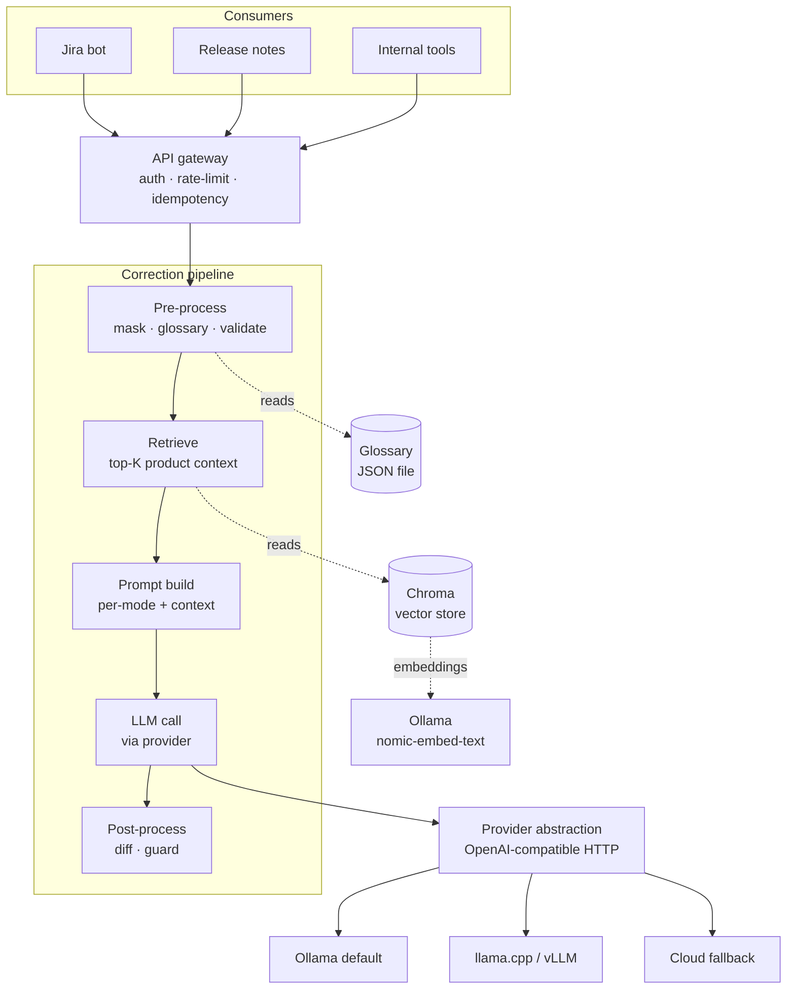

# Architecture

This document is the deep-dive on design rationale, trade-offs, and the roadmap. For setup, API reference, and operating instructions see the [README](../README.md).

## Goal

An internal HTTP service that grammar-, style-, and clarity-corrects English text on behalf of other internal tools (Jira bot, release-notes generator, CLI helpers). Backed by configurable LLM providers so models can be swapped without code changes. Grounded with per-tenant product knowledge so corrections respect domain meaning. Quality is measurable from day 1 via an eval harness and per-mode metrics.

## Current state



The pipeline is deterministic except for the `LLM call` stage. Pre- and post-processing, glossary masking, and RAG retrieval all happen outside the LLM, which keeps the model's job small and lets us reason about correctness.

## Locked decisions

| Decision | Choice |
|---|---|
| Service language | Python 3.12 + FastAPI |
| Dependency management | uv |
| Layout | `src/` |
| Deployment target | Kubernetes eventually (multi-stage Dockerfile from day 1) |
| Hardware constraint | CPU only on the dev path |
| Input languages | English only |
| Cloud fallback | Optional, key-gated, off by default |
| Vector store | Chroma embedded for Stage 2; pgvector swap in Phase 1 |

CPU-only means a 7B-class model takes one to a few seconds per request. We mitigate with:

- `quality_tier=fast` routes to a small model (e.g., `qwen2.5:0.5b`) for cheap interactive use.
- `quality_tier=balanced` (default) routes to a 7B-class model.
- `quality_tier=high` routes to a cloud provider when an API key is configured.
- Idempotency replays cache identical requests inside a 10-minute window with no LLM call.

## The correction pipeline in detail

### Pre-process

- **Length check**. Reject inputs over 5000 characters with HTTP 413. A chunker for long inputs is deliberately not in Stage 1 — see [What's out](#what-is-intentionally-out).
- **Language heuristic**. The ratio of ASCII letters to all letters must be ≥ 0.9. Catches the egregious non-English cases (CJK, Cyrillic, Arabic) without an extra dependency.
- **Masking**. Five built-in patterns are matched in order and replaced with `<<MASK_n>>` placeholders: code fences, inline code, URLs, `@mentions`, ticket IDs (`[A-Z]{2,}-\d+`).
- **Glossary masking**. All terms in the per-tenant glossary are matched (case-insensitive, word-boundary, longest first) and added to the same placeholder set. The model never sees protected content.

### RAG retrieval (Stage 2)

When the store has any docs and `use_rag` is on:

1. The input text is embedded via the configured embedding provider (Ollama `nomic-embed-text` by default, OpenAI-compat `/v1/embeddings`).
2. Chroma returns the top-K most similar chunks (cosine similarity), filtered by `min_score`.
3. The chunks are labeled `[source § section]` and injected into the system prompt as a context block before the mode-specific instructions.

The augmentation says: *"Use this context to preserve product-specific terminology and meaning. Do not introduce information not present in the input text."* The hallucination guard's new-entity check still catches doc-context injection the same way it catches general hallucination.

### Prompt build

One system prompt per mode (`grammar`, `style`, `jira-story`, `release-note`), each ending with the same rule: "Preserve any placeholders of the form `<<MASK_n>>` exactly as they appear. Return only the corrected text." When RAG context is present, the system prompt is augmented before the mode instructions.

Prompts are versioned (`PROMPT_VERSION = "v1"`). When the version changes, downstream caches and stored corrections become invalid.

### LLM call

The orchestrator asks the `ProviderRegistry` to route based on `(quality_tier, model_override)`, then calls `provider.generate(GenerationRequest)`. All providers in the current build are instances of `OpenAICompatProvider` configured with different `base_url` and `api_key` values.

### Post-process

The model's raw text is unmasked first, then run through the `hallucination_guard`. Four checks fail safe — when any one fires, the service returns the user's original text with `flagged: true`, the failure reason, and `model_output` set to what the model actually said.

| Check | What it catches |
|---|---|
| Leftover `<<MASK_` in output | Model invented or mangled a placeholder |
| Each input mask value missing from output | Model dropped a protected token (`@alice`, URL, `PROJ-123`, glossary term) |
| Edit ratio > per-mode threshold | Model rewrote far more than the mode allows |
| More than 2 new capitalized tokens not in input | Model hallucinated new named entities |

Edit-ratio thresholds:

| Mode | Threshold |
|---|---|
| `grammar` | 0.45 |
| `style` | 0.60 |
| `jira-story` | 0.80 |
| `release-note` | 0.80 |

See ADR-0006 for the threshold rationale and the regression test that pins the case that originally tuned them.

### Safe-fallback semantics

When the guard rejects, the service returns 200 OK with `flagged: true`, the user's original text in `corrected_text`, the rejection reason in `flag_reason`, and the rejected model output in `model_output`. ADR-0005 captures the rationale: internal callers want a safe default ("show me something I can ship") more than a hard failure they must handle.

## Glossary

Terms are stored in a JSON file at `GLOSSARY_PATH` (default `./data/glossary.json`). Managed via:

- `python -m text_checker.glossary add <term>` / `remove <term>` / `list` / `import <file>` / `reset`
- `python -m text_checker.glossary extract <file|dir>` — LLM-based extraction (ADR-0010). `--add` merges in one step; without it the command prints suggestions for review.

The masker treats glossary terms the same as built-in protected patterns (URLs, mentions, ticket IDs): match case-insensitively, restore canonical case from the glossary in the output. So a user typing "flowstate" gets "Flowstate" back, even if the LLM was never going to make that fix.

## RAG over product docs

Chroma embedded vector store at `RAG_STORE_PATH` (default `./data/rag/`), keyed by `RAG_COLLECTION_NAME`. Embeddings via Ollama's OpenAI-compat `/v1/embeddings` endpoint with `RAG_EMBEDDING_MODEL` (default `nomic-embed-text`).

Loaders (`src/text_checker/rag/loaders.py`) dispatch on file extension: markdown, plain text, HTML (BeautifulSoup + lxml), PDF (pdfplumber). New formats add one helper function each.

Chunker (`src/text_checker/rag/chunker.py`) splits on blank lines with greedy packing up to `max_chars` and `overlap` carry-over. Tracks the most recent markdown heading and tags each chunk with the section it was assembled under. The section is fixed when the chunk is emitted, not when the heading is seen — that was a subtle bug worth being explicit about.

Ingest semantics: `--source` is the logical re-ingest unit. Ingesting against an existing `--source` first removes its chunks, then adds the fresh ones. This is how "update with latest content" works without leaving stale chunks behind.

ADR-0009 records the choice to use Chroma embedded for Stage 2 and the planned swap to pgvector when Postgres arrives in Phase 1.

## Provider abstraction

Every provider speaks an OpenAI-compatible chat-completions interface. Swapping Ollama for vLLM, llama.cpp's `llama-server`, or Anthropic/OpenAI is a `base_url` and `api_key` change.

| Provider | Role | API |
|---|---|---|
| Ollama | Default local-dev and small-prod backend (also serves embeddings) | OpenAI-compatible |
| llama.cpp / vLLM | Heavier local inference (single GPU box) | OpenAI-compatible |
| Anthropic | Cloud fallback / `quality_tier=high` | OpenAI-compatible endpoint |
| OpenAI | Secondary cloud fallback | OpenAI-compatible |

Routing policy:

```
quality_tier=high, anthropic available → anthropic + claude-haiku-4-5
quality_tier=high, openai only         → openai + gpt-4o-mini
quality_tier=high, neither available   → ollama + default_model
quality_tier=fast                      → ollama + fast_model
quality_tier=balanced (default)        → ollama + default_model
model override set                     → ollama + that model
```

## Observability

- **Prometheus**: `correct_requests_total{mode, model, status}` counter and `correct_latency_seconds{mode, model}` histogram. `status` distinguishes successful corrections from flagged outputs from each error class. `rag_retrieval_score{mode}` histogram captures per-chunk cosine scores observed before `RAG_MIN_SCORE` filtering, so the floor can be calibrated empirically from real traffic.
- **Structured logs**: one JSON line per request via `structlog`, excluding the noise endpoints.
- **Tracing**: deferred to Phase 1.

## Hardening

All three are in-memory (single-replica) — see ADR-0007:

- API-key auth (`X-API-Key` validated against `API_KEYS`)
- Per-key token-bucket rate limit (60 req/min)
- Idempotency cache (`Idempotency-Key` header, 10-min TTL)

Moving to multi-replica deployment requires a shared store. Redis is the planned target — Phase 1.

## Roadmap

- **Stage 1.** Service, deterministic pipeline, provider abstraction, all four modes, hallucination guard with safe fallback, API-key auth, per-key rate limit, idempotency, Prometheus metrics, structured logs, golden-set eval harness.
- **Stage 2 (current).** Glossary store + masker integration, LLM-based glossary extraction, RAG over product docs (Chroma + Ollama embeddings, multi-format ingest, retrieval, orchestrator integration, per-request override, response context surfaced).
- **Phase 1 — Production readiness.** Redis-backed rate-limit and idempotency, Postgres request log, OpenTelemetry traces, active provider probe on `/readyz`, helm chart in `deploy/k8s/`. Swap Chroma to pgvector once Postgres is up.
- **Phase 2 — Quality flywheel + multi-tenancy.** Real eval metrics (GLEU, ERRANT F0.5, BERTScore, LLM-judge), per-model Grafana scorecard, `/v1/feedback` endpoint, A/B routing, shadow traffic, per-tenant isolation for glossary and RAG.
- **Phase 3 — Critic-reviser and chunker.** Opt-in `quality_tier=high` adds a bounded writer → critic → reviser loop. Sentence-aware chunker for long inputs.
- **Phase 4 — Example RAG and fine-tune.** Few-shot RAG over approved (before, after) corrections (L3 memory), per-tenant LoRA candidates gated by the eval harness (L4).

## Known model-quality-bound limitations

Surfaced by live testing on 2026-06-25 with `qwen2.5:7b-instruct`. Neither is a pipeline bug — both are bounded by model quality and addressed by either prompt engineering, a stronger model, or Phase 2 work.

**RAG over-grounding.** When RAG retrieves chunks closely matching the input, the 7B model occasionally lifts factual content from the chunks into its output, even though the system prompt says "Do not introduce information not present in the input text." Example: `"we improved the hallucination guard in text-checker"` (release-note mode) produced `"The Hallucination Guard in text-checker now returns the original text, not an error."` — the trailing clause is verbatim from ADR-0005's title. The hallucination guard does not catch this because the edit ratio (0.47) stays under the per-mode threshold and no masked tokens were dropped. Mitigations: sharper system prompt for non-grammar modes (Phase 2 candidate), LLM-judge for over-grounding detection (Phase 2), or stronger model.

**Pronoun substitution for placeholder.** In `style` mode with very short inputs (e.g., `"flowstate is great"`), the 7B model sometimes substitutes a pronoun for a masked glossary placeholder under the "tighten phrasing" instruction, producing output like `"It is great."`. The guard correctly rejects (canonical glossary term missing), so the user gets safe fallback. ADR-0012's fixes don't apply because no RAG context is involved and the model doesn't write the term in any case. Mitigation: stronger model. With `quality_tier=high` routing to a cloud provider, this case succeeds.

Both findings are recorded for future contributors so they aren't re-investigated as bugs. The safe-fallback design (ADR-0005) means users never see broken output from either failure mode — they get their original text plus `flagged: true` plus the model's actual output for debugging.

## What is intentionally out

Documented choices, not oversights.

- **Critic-reviser loop** (Phase 3). The single-call pipeline is sufficient for current modes.
- **Long-input chunker for the correction endpoint** (Phase 3). The 5000-char hard limit returns 413.
- **Example RAG and LoRA** (Phase 4). The glossary + product-knowledge RAG of Stage 2 covers most of the value with much less complexity.
- **Per-tenant scoping** for glossary and RAG (Phase 2). Single global store today.
- **Multilingual support**. English-only by design.
- **Streaming responses**. Latency budgets at 7B-on-CPU don't justify SSE complexity yet.
- **OpenTelemetry traces** (Phase 1). No backend to send traces to today.
- **Native Anthropic / OpenAI SDKs**. OpenAI-compatible HTTP covers everything we need.

## Design rationale: why a pipeline, not an agent?

A pipeline that calls one LLM with retrieved context (mode prompt, masked input, RAG context) is faster, cheaper, and more debuggable than an agent that decides which tools to call. For text correction we know what the model needs at every step — there is no open-ended planning to do. ADR-0003 records this in detail.

The critic-reviser pattern planned for Phase 3 is the one "agent-shaped" addition, and it's tightly bounded: max one revision, structured JSON critic output, opt-in per request.

## Design rationale: why mask, instead of trusting the model?

Even strong models occasionally rewrite content they shouldn't — turning `@alice` into "Alice", a URL into a hyperlink phrase, `PROJ-123` into "the project". For protected content the cost of an LLM mistake is high. Deterministic masking moves these guarantees out of "the model usually does the right thing" into "the protected token is replaced with itself or the request is flagged." The guard's "every input mask value must survive in output" check enforces this end-to-end.

The glossary extends this same machinery to per-tenant product terminology. The model cannot rewrite Flowstate to Flow state, because it never sees "Flowstate" — it sees `<<MASK_4>>` and outputs it verbatim.
