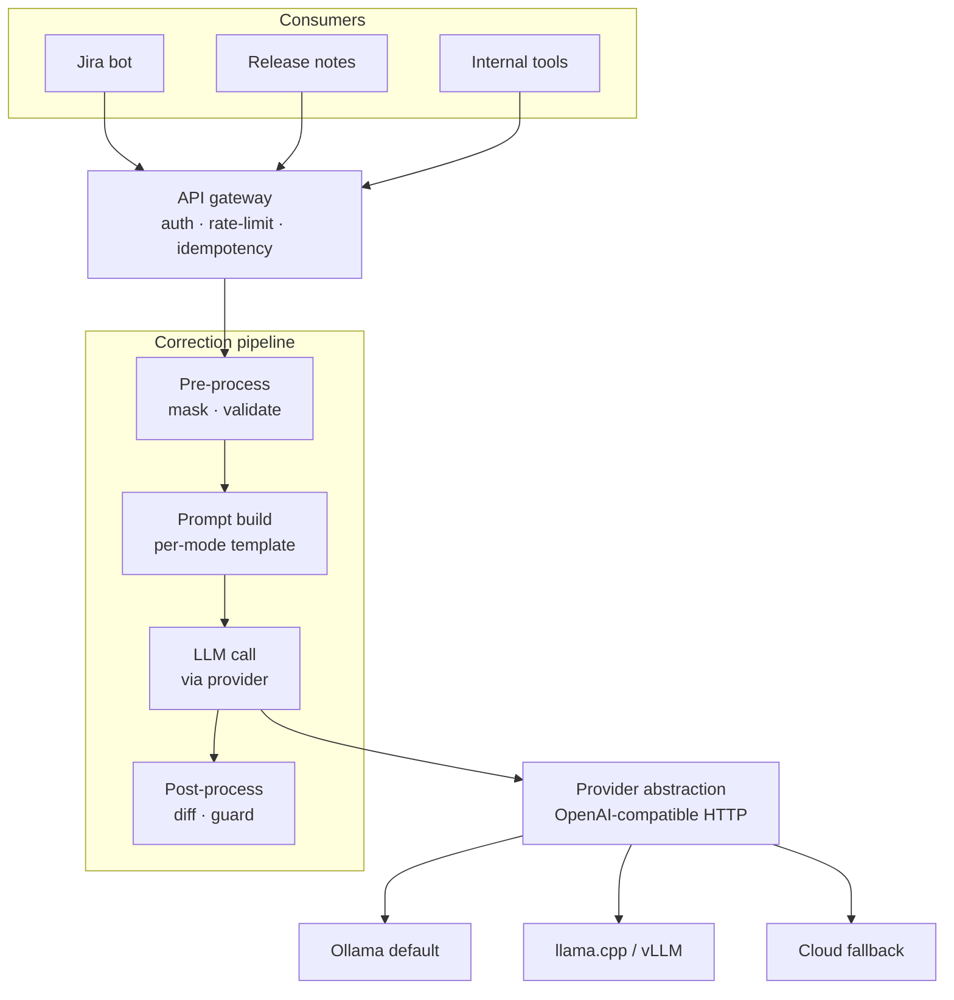

# Architecture

This document is the deep-dive on design rationale, trade-offs, and the roadmap. For setup, API reference, and operating instructions see the [README](../README.md).

## Goal

An internal HTTP service that grammar-, style-, and clarity-corrects English text on behalf of other internal tools (Jira bot, release-notes generator, CLI helpers). Backed by configurable LLM providers so models can be swapped without code changes. Quality is measurable from day 1 via an eval harness and per-mode metrics.

## Stage 1 (current)



The pipeline is deterministic except for the `LLM call` stage. Pre- and post-processing handle the edge cases (masking code blocks and `@mentions`, validating input, guarding output) outside the LLM, which keeps the model's job small and lets us reason about correctness.

## Locked decisions

| Decision | Choice |
|---|---|
| Service language | Python 3.12 + FastAPI |
| Dependency management | uv |
| Layout | `src/` |
| Deployment target | Kubernetes eventually (multi-stage Dockerfile from day 1) |
| Hardware constraint | CPU only on the dev path |
| Input languages | English only |
| Cloud fallback | Optional, key-gated, off by default |

CPU-only means a 7B-class model takes one to a few seconds per request. We mitigate with:

- `quality_tier=fast` routes to a small model (e.g., `qwen2.5:0.5b`) for cheap interactive use.
- `quality_tier=balanced` (default) routes to a 7B-class model.
- `quality_tier=high` routes to a cloud provider when an API key is configured.
- Idempotency replays cache identical requests inside a 10-minute window with no LLM call.

## The correction pipeline in detail

### Pre-process

- **Length check**. Reject inputs over 5000 characters with HTTP 413. A chunker for long inputs is deliberately not in Stage 1 — see [What's out](#what-is-intentionally-out-of-stage-1).
- **Language heuristic**. The ratio of ASCII letters to all letters must be ≥ 0.9. Catches the egregious non-English cases (CJK, Cyrillic, Arabic) without an extra dependency. A `langdetect`-based replacement is a Phase 1 candidate if false positives surface.
- **Masking**. Five patterns are matched in order and replaced with `<<MASK_n>>` placeholders: code fences, inline code, URLs, `@mentions`, and ticket IDs (`[A-Z]{2,}-\d+`). The mapping is kept and applied in reverse after generation. The LLM never sees the protected content, so it cannot rewrite it.

### Prompt build

One system prompt per mode (`grammar`, `style`, `jira-story`, `release-note`), each ending with the same rule: "Preserve any placeholders of the form `<<MASK_n>>` exactly as they appear. Return only the corrected text." User content is passed through unchanged in the user role.

Prompts are versioned (`PROMPT_VERSION = "v1"`). When the version changes, downstream caches and stored corrections become invalid — this matters once the eval flywheel (Phase 2) starts storing scored runs.

### LLM call

The orchestrator asks the `ProviderRegistry` to route the request based on `(quality_tier, model_override)`, then calls `provider.generate(GenerationRequest)`. The provider abstraction is one method (`generate`) plus a `health()` probe. All providers in Stage 1 are instances of `OpenAICompatProvider` configured with different `base_url` and `api_key` values.

### Post-process

The model's raw text is unmasked first, then run through the `hallucination_guard`. Four checks fail safe — when any one fires, the service returns the user's original text with `flagged: true`, the failure reason, and `model_output` set to what the model actually said.

| Check | What it catches |
|---|---|
| Leftover `<<MASK_` in output | Model invented or mangled a placeholder |
| Each input mask value missing from output | Model dropped a protected token (`@alice`, URL, `PROJ-123`) |
| Edit ratio > per-mode threshold | Model rewrote far more than the mode allows |
| More than 2 new capitalized tokens not in input | Model hallucinated new named entities |

Edit-ratio thresholds:

| Mode | Threshold | Rationale |
|---|---|---|
| `grammar` | 0.45 | Allow several fixes on short inputs while rejecting wholesale rewrites |
| `style` | 0.60 | Style rewrites are more invasive than grammar fixes |
| `jira-story` | 0.80 | Restructuring shorthand into "As a … I want … so that …" needs substantial leeway |
| `release-note` | 0.80 | Verb-first one-liners may share little surface with the input |

These thresholds were tuned after live testing. The grammar threshold started at 0.30 and rejected legitimate short-input fixes; raising it to 0.45 fixed that without making the guard meaningless.

### Safe-fallback semantics

When the guard rejects, the service does **not** return an error. It returns 200 OK with `flagged: true`, the user's original text in `corrected_text`, the rejection reason, and the model's actual output in `model_output`. Rationale: internal callers (a Jira bot) want a safe default ("show me something I can ship") more than they want a hard failure they have to handle.

## Provider abstraction

Every provider speaks an OpenAI-compatible chat-completions interface. Swapping Ollama for vLLM, llama.cpp's `llama-server`, or Anthropic/OpenAI is a `base_url` and `api_key` change.

| Provider | Role | API |
|---|---|---|
| Ollama | Default local-dev and small-prod backend | OpenAI-compatible |
| llama.cpp / vLLM | Heavier local inference (single GPU box) | OpenAI-compatible |
| Anthropic | Cloud fallback / `quality_tier=high` | OpenAI-compatible endpoint |
| OpenAI | Secondary cloud fallback | OpenAI-compatible |

Native SDKs (Anthropic Python SDK, etc.) are intentionally not added. The OpenAI-compat endpoint each vendor publishes is sufficient for chat-completion semantics, and keeping the surface to one HTTP client means contract tests cover every backend.

The `ProviderRegistry` initializes providers from `Settings`:

```
"ollama"    → always present (uses OLLAMA_BASE_URL)
"anthropic" → registered iff ANTHROPIC_API_KEY is set
"openai"    → registered iff OPENAI_API_KEY is set
```

Routing policy:

```
quality_tier=high, anthropic available → anthropic + claude-haiku-4-5
quality_tier=high, openai only         → openai + gpt-4o-mini
quality_tier=high, neither available   → ollama + default_model
quality_tier=fast                      → ollama + fast_model
quality_tier=balanced (default)        → ollama + default_model
model override set                     → ollama + that model
```

## Observability

- **Prometheus**: `correct_requests_total{mode, model, status}` counter and `correct_latency_seconds{mode, model}` histogram. `status` distinguishes successful corrections from flagged outputs from each error class. See [README → Operating](../README.md#operating-the-service).
- **Structured logs**: one JSON line per request via `structlog`, excluding the noise endpoints (`/healthz`, `/readyz`, `/metrics`).
- **Tracing**: deferred. OpenTelemetry instrumentation lands in Phase 1 once a backend (Tempo, Jaeger, an OTLP collector) is on the table to send traces to. Wiring it now would add no value.

## Hardening

All three are in-memory (single-replica) in Stage 1:

- **API-key auth**: `X-API-Key` header validated against `API_KEYS`. When `API_KEYS` is empty, auth is disabled (dev-friendly default).
- **Per-key token-bucket rate limit**: 60 req/min per key.
- **Idempotency cache**: `Idempotency-Key` header replays the cached response for 10 minutes without re-calling the provider.

Moving any of these to multi-replica deployment requires a shared store. Redis is the planned target — tracked as a Phase 1 task.

## Roadmap

- **Stage 1 (current).** Service, deterministic pipeline, provider abstraction, all four modes, hallucination guard with safe fallback, API-key auth, per-key rate limit, idempotency, Prometheus metrics, structured logs, golden-set eval harness, ~75 tests.
- **Phase 1 — Production readiness.** Redis-backed rate-limit and idempotency, Postgres request log, OpenTelemetry traces, active provider probe on `/readyz`, helm chart in `deploy/k8s/`.
- **Phase 2 — Quality flywheel.** Real eval metrics (GLEU, ERRANT F0.5, BERTScore, LLM-judge), per-model Grafana scorecard, `/v1/feedback` endpoint, A/B routing, shadow traffic.
- **Phase 3 — Critic-reviser.** Opt-in `quality_tier=high` adds a bounded writer → critic → reviser loop. Critic emits structured JSON; max one revision pass; circuit-break on cost. Also: sentence-aware chunker for long inputs.
- **Phase 4 — Memory and fine-tune.** Glossary (deterministic per-tenant term protection), style rules, RAG over approved corrections, per-tenant LoRA candidates gated by the eval harness.

## What is intentionally out of Stage 1

These were considered and deliberately deferred. Documenting them here so a future contributor knows they're choices, not oversights.

- **Critic-reviser loop** (Phase 3). The single-call pipeline is sufficient for grammar/style/jira-story/release-note. The loop earns its keep only for high-stakes external content.
- **Memory of any kind**: glossary, RAG, fine-tune (Phase 4). Stage 1 has no per-tenant adaptation.
- **Long-input chunker**. The 5000-char hard limit returns 413; we add a sentence-aware chunker when a real consumer hits the limit.
- **Multilingual support**. English-only by design; non-English inputs return 422.
- **Streaming responses**. Latency budgets at 7B-on-CPU don't justify SSE complexity for Stage 1.
- **OpenTelemetry traces** (Phase 1). No backend to send traces to today.
- **Native Anthropic / OpenAI SDKs**. OpenAI-compatible HTTP covers everything Stage 1 needs.

## Design rationale: why a single-call pipeline, not an agent?

A pipeline that calls one LLM with retrieved context (mode prompt, masked input) is faster, cheaper, and more debuggable than an agent that decides which tools to call. For text correction we know what the model needs at every step — there is no open-ended planning to do. The critic-reviser pattern in Phase 3 is the one "agent-shaped" addition, and it's tightly bounded: max one revision, structured JSON critic output, opt-in per request. Everything beyond that is YAGNI for this product.

## Design rationale: why mask, instead of trusting the model?

Even strong models occasionally rewrite content they shouldn't — turning `@alice` into "Alice", a URL into a hyperlink phrase, `PROJ-123` into "the project". For protected content the cost of an LLM mistake is high (broken automation, missing links, lost references). Deterministic masking moves these guarantees out of "the model usually does the right thing" into "the protected token is replaced with itself or the request is flagged." The guard's "every input mask value must survive in output" check enforces this end-to-end.
