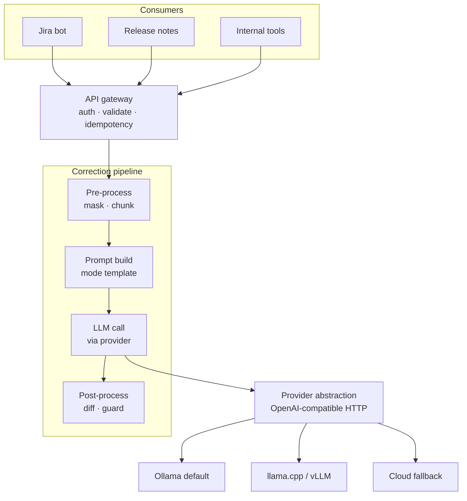

# Architecture

## Goal

An internal HTTP service that grammar-, style-, and clarity-corrects English text on behalf of other internal tools (Jira bot, release-notes generator, CLI helpers). Backed by configurable LLM providers so models can be swapped without code changes.

## Stage 1 (current)

The pipeline is deterministic except for the `LLM call` stage. Pre- and post-processing handle the edge cases (masking code blocks and `@mentions`, chunking long input, validating output) outside the LLM, which keeps the model's job small and lets us reason about correctness.

## Locked decisions

| Decision | Choice |
|---|---|
| Service language | Python 3.12 + FastAPI |
| Dependency management | uv |
| Layout | `src/` |
| Deployment target | Kubernetes eventually (multi-stage Dockerfile from day 1) |
| Hardware constraint | CPU only |
| Input languages | English only |
| Cloud fallback | Optional, key-gated, off by default |

CPU-only means a 7B-class model takes seconds per request. We mitigate with:
- A small default model for `mode=grammar` (Phi-3.5-mini or CoEdIT).
- 7–8B reserved for higher-value modes (`jira-story`, `release-note`).
- `quality_tier=high` routes to the cloud provider when keys are configured.
- Aggressive caching on `(input + mode + model)` hash.

## Provider abstraction

Every provider speaks an OpenAI-compatible chat-completions interface. Swapping Ollama for vLLM, llama.cpp's `llama-server`, or Anthropic/OpenAI is a config change, not a code change.

| Provider | When | API |
|---|---|---|
| Ollama | Default for local dev and small prod | OpenAI-compatible |
| llama.cpp / vLLM | Heavier local inference, GPU box | OpenAI-compatible |
| Anthropic | Cloud fallback / `quality_tier=high` | Native + OpenAI-compatible |
| OpenAI | Cloud fallback / `quality_tier=high` | Native |

## Roadmap

- **Phase 0 — walking skeleton.** FastAPI app, healthz, provider abstraction, single mode, Ollama wired up end-to-end.
- **Phase 1 — productionize.** All four modes, prompt registry, Prometheus, OpenTelemetry, structured request log, API keys, rate limit, idempotency, Redis cache.
- **Phase 2 — quality flywheel.** Golden eval harness, GLEU/BERTScore/LLM-judge scoring, per-model scorecard in Grafana, `/v1/feedback` endpoint, A/B routing.
- **Phase 3 — critic-reviser.** Opt-in `quality_tier=high` adds a bounded writer → critic → reviser loop. Critic emits structured JSON; max one revision pass; circuit-break on cost.
- **Phase 4 — memory and fine-tune.** Glossary, style rules, RAG over approved corrections, per-tenant LoRA candidates promoted only through the eval gate.

## What is intentionally out of Stage 1

- Critic-reviser loop (Phase 3).
- Memory of any kind: glossary, RAG, fine-tune (Phase 4).
- Multilingual support.
- Streaming responses.

Tracking these here so a future contributor knows they are deferred, not forgotten.
