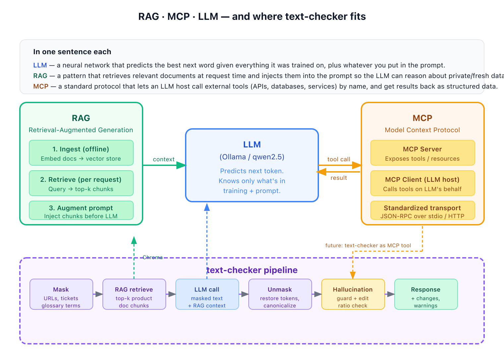

# Concepts: LLM, RAG, and MCP

> Read this if you want to understand the ideas behind text-checker — what LLMs, RAG, and MCP are, and how they fit together. No setup, no code paths.

A short reference for the three foundational concepts behind text-checker — what each one is, why it exists, and how they fit together in this project.



---

## LLM — the brain

A **Large Language Model** is a neural network trained on massive amounts of text. Given everything it was trained on plus whatever you put in the prompt, it predicts the most likely next token (word fragment). Repeat that prediction many times and you get a coherent response.

Key constraints:
- **No memory between calls** — each request is independent; the model has no recollection of previous requests.
- **No live data access** — it knows only what was in its training corpus, which has a cutoff date.
- **No knowledge of your private docs** — it has never seen your style guide, product terminology, or internal naming conventions.
- **Can hallucinate** — it generates plausible-sounding text even when it doesn't actually know the answer.

**In text-checker:** [Ollama](https://ollama.ai) runs the model locally (default: `qwen2.5:7b-instruct`). The pipeline sends a structured prompt and the model returns corrected text. The hallucination guard and edit-ratio check exist precisely because the LLM can get things wrong.

---

## RAG — giving the LLM a reference book

**Retrieval-Augmented Generation** solves the "LLM doesn't know your private docs" problem without fine-tuning the model. It works in two phases:

### Phase 1 — Ingest (offline, one-time or periodic)

```
Your docs (PDFs, markdown, HTML, plain text)
   ↓
Split into overlapping chunks (up to ~1500 chars, 200-char overlap, section-aware)
   ↓
Each chunk → embedding model → vector (hundreds of numbers capturing meaning;
                                        768 dims for nomic-embed-text)
   ↓
Stored in a vector database (Chroma in text-checker, at ./data/rag/)
```

This is called **ingestion** (also called indexing or training the RAG). You run it once when your docs change.

```bash
# local store (dev)
python -m text_checker.rag ingest path/to/your/docs/ --source product-docs

# against a running server (production — see README "Remote ingestion")
python -m text_checker.rag ingest path/to/your/docs/ --source product-docs \
  --server http://localhost:8080 --api-key <key>
```

### Phase 2 — Retrieve + Augment (per request, automatic)

```
User's input text
   ↓
Same embedding model → vector
   ↓
Vector similarity search against the store → top-k most relevant chunks
   ↓
Chunks injected into the LLM prompt alongside the user's text
   ↓
LLM now "knows" your product docs for this request
```

The LLM never sees your whole document library — only the 3–5 chunks most relevant to the current input. This keeps the prompt short and the answer focused.

> **Embedding and chat can live on different hosts.** RAG needs an embedding endpoint (`/v1/embeddings`); the chat model does not have to expose one. Set `RAG_EMBEDDING_BASE_URL` if the LLM host doesn't ship embeddings — see the [README's "Split embedding and chat backends"](../README.md#split-embedding-and-chat-backends) recipe.

### Why RAG instead of fine-tuning?

| | RAG | Fine-tuning |
|---|---|---|
| Update docs | Re-ingest (minutes) | Retrain (hours/days, expensive) |
| Explainability | You can see which chunks were used | Opaque |
| Cost | Cheap — just a vector search | Expensive GPU compute |
| Best for | Factual grounding, up-to-date knowledge | Changing the model's style or behavior |

**In text-checker:** RAG is active for `style`, `jira-story`, and `release-note` modes (skipped for `grammar` by default — grammar is language-universal, no product context needed; the skip list is configurable via `RAG_SKIP_MODES`). The retrieved chunks ground the model in your product's specific terminology, so it doesn't invent names or rewrite technical terms.

Relevance is measured by a similarity score (0–1). Only chunks scoring above `RAG_MIN_SCORE` (default `0.50`) are injected. You can tune this threshold based on the `rag_retrieval_score` Prometheus histogram.

---

## MCP — a standard way to give an LLM hands

**Model Context Protocol** (open standard by Anthropic) defines a common interface between an LLM host and external capabilities. Instead of every integration being bespoke HTTP glue code, MCP standardizes it:

```
LLM host (Claude Code, Claude API agent)
   ↓  discovers tools via MCP
MCP Server  (exposes: name, description, input schema)
   ↓  executes the actual work
Your service / database / API
```

The LLM decides when to call a tool based on its name and description. The host executes the call, gets a structured result back, and the LLM incorporates it into its response. Think of it like USB-C: one standard plug, many devices.

MCP servers communicate over JSON-RPC, either via stdio (local processes) or HTTP (remote services).

### MCP vs RAG

| | RAG | MCP |
|---|---|---|
| What it provides | Static knowledge (documents) | Dynamic actions (tool calls) |
| When it runs | Before the LLM generates | During LLM generation (on demand) |
| Examples | Style guide chunks, product docs | Search, database lookup, API calls |
| LLM awareness | LLM sees context in prompt | LLM actively chooses to call the tool |

**RAG = reference book. MCP = phone the LLM can pick up and call someone.**

### MCP in text-checker

text-checker ships an MCP server as of ADR-0015. It's a thin HTTP client of the running text-checker service that exposes four tools — `correct_text`, `list_modes`, `list_models`, `ingest_document` — over both stdio (for VS Code Copilot Chat and Claude Code) and streamable HTTP on port 8081 (for remote bots). The HTTP transport requires the same `X-API-Key` the main service does; if no key is configured, the server fails closed rather than silently allowing traffic.

> **Scope.** text-checker only implements the **MCP server** side. It does not consume any other MCP servers — the correction pipeline is deterministic (ADR-0003) and does not perform tool-use loops. If you're looking for an LLM that can call MCP tools during reasoning, that's a different product shape than this one.

Start it locally:

```bash
# stdio (for VS Code — the client owns the process)
text-checker-mcp

# HTTP (for shared team access)
MCP_API_KEY=my-key text-checker-mcp --http
```

Or via docker-compose profile:

```bash
docker compose --profile mcp up -d
```

See [ADR-0015](decisions/0015-mcp-server.md) for the design rationale and [Jira bot integration](integrations/jira-bot.md) for a worked webhook example.

#### text-checker as an MCP hub

```
                            ┌──────────────────────────────────┐
                            │      text-checker MCP server     │
                            │                                  │
   VS Code Copilot ─stdio──▶│  correct_text(text, mode, model) │──▶ POST /v1/correct
   Claude Code ─────stdio──▶│  list_modes()                    │──▶ GET  /v1/modes
                            │  list_models()                   │──▶ GET  /v1/models
   Jira Bot ──HTTP:8081────▶│  ingest_document(content, src)   │──▶ POST /v1/rag/ingest
                            └──────────────────────────────────┘
                                          │
                                  All guardrails apply:
                                  mask → RAG → LLM → guard

   GitHub Actions / CI ──── text-checker-check CLI ──▶ POST /v1/correct  (no MCP —
                                                        plain HTTP, exit codes for CI)
```

The MCP server is a thin wrapper over the existing HTTP API. All pipeline guardrails — masking, hallucination guard, edit-ratio — run as normal. MCP just provides the standard plug. CI pipelines skip MCP entirely and use the `text-checker-check` CLI against the REST API — MCP adds nothing for a non-LLM caller.

Three shipped integrations use this MCP server or the plain HTTP API:

- [VS Code Copilot Chat](integrations/vscode-copilot.md) — MCP stdio
- [Jira bot pattern](integrations/jira-bot.md) — HTTP webhooks
- [GitHub Actions CI linting](../deploy/github-actions/lint-release-notes.yml) — text-checker-check CLI

#### Transport: stdio vs HTTP

| Transport | Use case | How to run |
|---|---|---|
| **stdio** | VS Code Copilot Chat, Claude Code, local IDE plugins | `text-checker-mcp` (process started by the MCP client; config via `TEXT_CHECKER_URL` / `TEXT_CHECKER_API_KEY` env) |
| **Streamable HTTP** | Jira Bot, remote agents, multi-user (port 8081) | `MCP_API_KEY=<key> text-checker-mcp --http` — requires `X-API-Key`, fails closed without a configured key |

#### Tools exposed

| Tool | Inputs | Returns |
|---|---|---|
| `correct_text` | `text: str`, `mode: str`, `model: str \| None` | full `/v1/correct` response: `corrected_text`, `diff[]`, `flagged`, `flag_reason`, `rag_context_used[]`, `metrics` |
| `list_modes` | — | `["grammar", "style", "jira-story", "release-note"]` |
| `list_models` | — | `[{provider, model}]` — round-trip any entry back as `provider:model` in `correct_text` |
| `ingest_document` | `content: str`, `source: str`, `label: str \| None` | `{source, chunks_indexed}` |

`ingest_document` lets a Jira Bot or a developer in chat push new product docs into the shared RAG store at runtime — no shell access to the server required.

---

For the full VS Code Copilot Chat walkthrough with worked example conversations, see [docs/integrations/vscode-copilot.md](integrations/vscode-copilot.md).

---

## How they work together in text-checker

```
POST /v1/correct
       ↓
┌─────────────────────────────────────────────────────────┐
│                  text-checker pipeline                  │
│                                                         │
│  1. Mask          hide URLs, tickets, glossary terms    │
│       ↓                                                 │
│  2. RAG retrieve  fetch relevant product doc chunks     │
│       ↓                                                 │
│  3. LLM call      masked text + RAG context → Ollama   │
│       ↓                                                 │
│  4. Unmask        restore protected tokens              │
│       ↓                                                 │
│  5. Hallucination guard + edit-ratio check              │
│       ↓                                                 │
│  6. Response      corrected text + changes + warnings   │
└─────────────────────────────────────────────────────────┘
```

- **LLM** does the reasoning and text generation (step 3).
- **RAG** provides the product-specific context that makes the LLM's output accurate for your domain (step 2).
- **MCP** is the integration layer (shipped — ADR-0015) that lets MCP clients like VS Code Copilot Chat and Claude Code call text-checker as a first-class tool. text-checker implements the server side only; the pipeline itself never calls out to MCP tools.

The masking, hallucination guard, and edit-ratio thresholds are text-checker's own guardrails — the pipeline-level safety layer that protects against the LLM's inherent tendency to hallucinate or over-edit.

---

## Further reading

- [Architecture overview](architecture.md) — full system diagram and component descriptions
- [ADR-0003](decisions/0003-deterministic-pipeline-not-agent.md) — why a deterministic pipeline, not an LLM agent
- [ADR-0009](decisions/0009-chroma-embedded-for-rag-store.md) — why Chroma for the RAG vector store
- [ADR-0010](decisions/0010-llm-based-glossary-extraction.md) — LLM-based glossary extraction
- [ADR-0011](decisions/0011-tighter-rag-defaults.md) — RAG min-score calibration
- [ADR-0012](decisions/0012-glossary-rag-interaction.md) — how glossary masking and RAG interact
