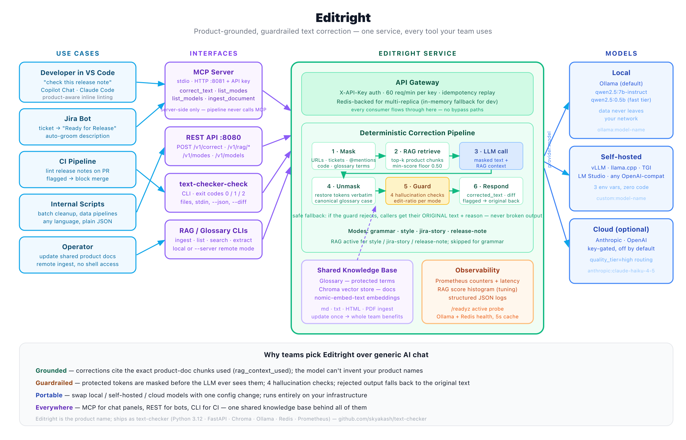
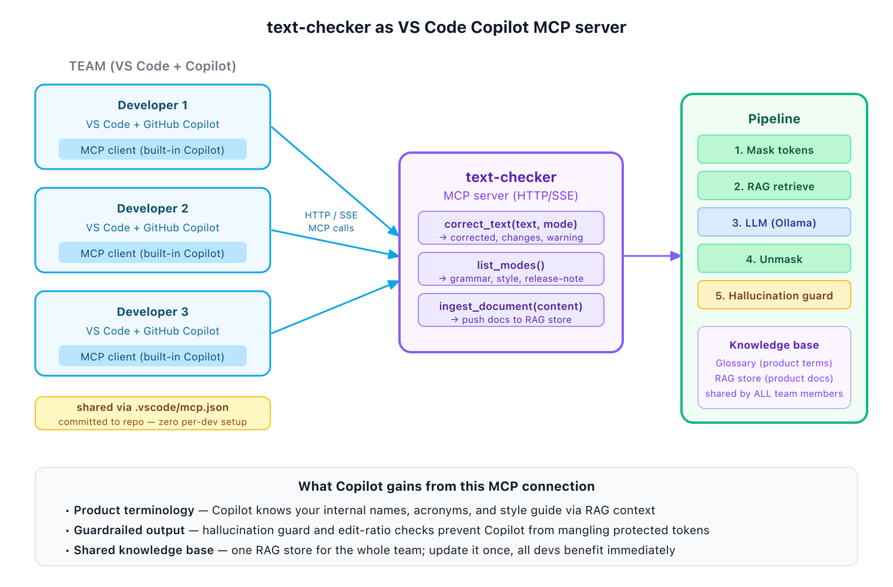

# Editright

**Product-grounded, guardrailed text correction for engineering teams — in every tool your team already uses.**

<sub>Editright is the product name. The runtime, package, and CLIs still ship as `text-checker` / `text-checker-mcp` / `text-checker-check`.</sub>

---

## The problem

Every engineering team ships release notes, Jira stories, PR descriptions, and internal docs. Two things go wrong:

1. **Voice and terminology drift.** "Flowstate" becomes "Flow state." A ticket capitalises `PROJ-123` differently every release. Style-guide rules exist in a wiki no one reads.
2. **Generic AI editors don't help.** GitHub Copilot, ChatGPT, and other LLM tools were trained on the public internet — they don't know your product names, your feature acronyms, or your team's writing conventions. They'll happily "fix" `PROJ-123` into "the project" and rename your service.

The result is invisible tax: senior engineers rewriting drafts, release managers hand-editing notes, PMs re-explaining the same style rules quarter after quarter.

## The pitch

Editright is an internal service that corrects grammar, style, and release notes with **your product's terminology baked in**. It plugs into VS Code, Jira bots, CI pipelines, and any tool that speaks HTTP — one shared knowledge base, every team member benefits immediately.

## Feature highlights

- **Product-aware corrections.** RAG over your product docs + a protected glossary means the model never invents names or rewrites domain terms. Update the docs once, every consumer sees the change.
- **Guardrailed by design.** A hallucination guard rejects outputs that drop protected tokens, over-edit the input, or invent new named entities. Rejected outputs fall back to the original text plus a diagnostic — users never see broken output.
- **Model-portable.** One config change flips the whole team between local Ollama, self-hosted vLLM/llama.cpp, or hosted Anthropic/OpenAI. `provider:model` syntax on every request.
- **MCP-native.** Works out of the box in VS Code Copilot Chat, Claude Code, and any MCP client. `.vscode/mcp.json` committed to your repo means zero per-developer setup.
- **CI-friendly.** `text-checker-check` returns proper exit codes so PRs with off-brand release notes can fail the build. Reference GitHub Actions workflow included.
- **Bot-friendly.** Jira, Slack, and webhook integrations point at the same `/v1/correct` endpoint. Documented pattern for auto-grooming release-note tickets on status transition.
- **Observable from day one.** Prometheus metrics, structured logs, `/readyz` active probe, retrieval-score histogram for tuning RAG thresholds from real traffic.
- **Runs on your infrastructure.** Docker Compose, systemd, or Kubernetes-ready. No data leaves your network unless you configure a cloud model.

## Where it fits



<sub>Deep-dive version of the concepts: [RAG / MCP / LLM overview](images/rag-mcp-llm-overview.png)</sub>

| Consumer | How it connects | Typical use |
|---|---|---|
| VS Code + Copilot Chat / Claude Code | MCP (stdio or HTTP) | "Fix the grammar in the selected text"; "check this release note" |
| Jira bot | Webhook → HTTP or MCP | Auto-groom ticket descriptions on transition to "Ready for Release" |
| GitHub Actions / CI | `text-checker-check` CLI | Lint changed `release-notes/*.md` on every PR; fail the check when guard rejects |
| Internal scripts | `POST /v1/correct` | Batch correction; one-off cleanup; data pipelines |
| Operators | RAG CLI `--server` mode | Update the shared knowledge base without shell access to the server |

## Team workflow



One shared Editright server. One shared RAG store. Every developer's Copilot Chat asks the same tools; every correction respects the same product terminology. When product docs change, one operator re-ingests — every developer's next correction reflects the update immediately.

## What makes it different

Compared to generic LLM chat, Editright is:

- **Grounded, not guessing.** Corrections cite the exact product-doc chunks used. The response includes `rag_context_used` so a reader can audit what the model saw.
- **Safe by default.** Four independent hallucination checks; when any fails, the original text comes back unchanged with a diagnostic. Compare to "the LLM said something weird and you have to notice."
- **Deterministic where it can be.** URLs, mentions, ticket IDs, and glossary terms are masked before the LLM sees them and restored verbatim after. Protected tokens can't be rewritten because the model never sees them.
- **Portable in the ways that matter.** The LLM is one component; you can swap it. The knowledge base is yours; it never leaves your infrastructure. The consumers speak MCP or plain HTTP — no vendor lock-in.
- **Team-scoped from day one.** A single shared RAG store beats every developer maintaining their own prompts. Update once, everyone benefits.

## Try it in 60 seconds

```bash
# 1. Clone and install
git clone https://github.com/skyakash/text-checker.git && cd text-checker
uv sync

# 2. Point at a local Ollama (or set OLLAMA_BASE_URL to any host)
ollama pull qwen2.5:7b-instruct
ollama pull nomic-embed-text

# 3. Start the service
API_KEYS="dev-key" make dev

# 4. Ingest a product doc via the running server (Chroma stays isolated
#    to the service process — never open it from a second CLI process)
uv run python -m text_checker.rag ingest ./docs/product-overview.md \
  --source overview \
  --server http://localhost:8080 --api-key dev-key

curl -s -X POST http://localhost:8080/v1/correct \
  -H "X-API-Key: dev-key" -H "Content-Type: application/json" \
  -d '{"text":"shipped a new integration for editright","mode":"release-note"}'
```

Under 60 seconds gets you: guarded, RAG-grounded correction against your own docs, with `rag_context_used` showing exactly which doc chunks the model saw.

## Ecosystem at a glance

- Source: [github.com/skyakash/text-checker](https://github.com/skyakash/text-checker)
- Deep dive: [Concepts (LLM, RAG, MCP)](concepts.md) · [Architecture](architecture.md)
- Design decisions: [ADR index](decisions/README.md)
- Task/roadmap: [Task list](tasks.md)
- Integrations: [Jira bot](integrations/jira-bot.md) · [GitHub Actions](../deploy/github-actions/lint-release-notes.yml) · [VS Code](../.vscode/mcp.json)

## About the name

Editright is the product / marketing name — used in demos, decks, and external comms. The runtime keeps its original identifiers so existing deployments, env vars, Docker images, and CLIs (`text-checker-mcp`, `text-checker-check`, `text_checker` Python package) are unchanged. A full identifier rename is a separate decision — the marketing name doesn't require it.
